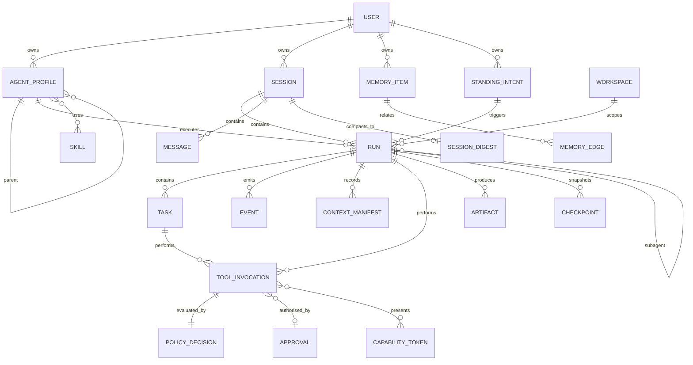

# Data Model

Entities, ownership, lifecycle, relationships, retention. Two physically separate stores, because the boundary between them is the security architecture.

---

## 1. Two stores, one rule

| Store | Owner (OS user) | Runtime access | Contents |
|---|---|---|---|
| `runtime.db` | `direwolf-runtime` | read/write | sessions, runs, tasks, messages, events, memory **content**, artifact **content-metadata**, skills **content**, agents, schedules |
| `kernel.db` | `direwolf-kernel` | **none** | capabilities, approvals, grants, budgets, secrets index, policy hashes, worker registry, **lease epochs**, **and every policy input** — see below |
| `audit.log` | `direwolf-kernel` | **none** (append-only, even for the kernel) | hash-chained security record |

**The rule: a process may not write the state that constrains it.** If approvals and budgets lived in `runtime.db`, a compromised runtime would grant itself approvals and reset its own budget, and the architecture would be a diagram rather than a mechanism. Filesystem permissions enforce this; `direwolf doctor` verifies it and refuses to start if the runtime user can write `kernel.db`.

### Policy inputs live in `kernel.db`, without exception

It is not sufficient for capability *tokens* to be unforgeable. Every field the policy engine matches on is equally load-bearing, and a field stored where the constrained process can write it is not a constraint but a suggestion.

| Field | Why it is a policy input | Kernel derives it from |
|---|---|---|
| `taint_level` | `approve-egress-when-tainted`; `require_untainted_run` grants; the approval prompt's warning | Trust labels of every tool result and artifact it produced |
| `origin` | `deny-approval-needed-when-unattended`; `interactive_only` grants | Which API created the run and whether an approval channel is attached |
| `privacy_class` | Model egress upstream enforcement | Policy at admission + workspace sensitivity |
| `workspace.sensitivity` | Sets the default privacy class | Operator configuration, kernel-side |
| Active skill set + trust levels | `agent ∩ skills` in capability minting | Skills registered and verified kernel-side at admission |
| Artifact `trust` / `provenance` | Taint derivation; memory promotion | The kernel created the artifact |
| Memory item `trust` / `provenance` | The promotion gate | Recorded when the kernel admitted the write |

**What exists as of M3d** ([ADR-0039](adr/0039-durable-authority-state.md) §10). Each admitted run has a `run_policy_input` row, and a live decision builds its policy context from that row and nothing else; no DWKP message has a field for any of these, and the decoder refuses each one as an unknown member. Where the producer the table names does not exist yet, the kernel derives the **restrictive** value and says so:

| Field | Stored as | Derived today | Real producer |
|---|---|---|---|
| `taint_level` | `run_policy_input.taint`, a trigger forbids it falling | `none` at admission; raised only through one audited, monotonic kernel interface | tool results (M4), artifacts (M12), memory (M13) — nothing calls the interface yet |
| `origin` | `run_policy_input.origin`, fixed by trigger | `api` for every run: unattended, because no attended channel exists | gateway, scheduler, M6's approval channel |
| `privacy_class` | `run_policy_input.privacy`, fixed by trigger | the stricter of the agent profile's default and the workspace's ceiling; no kernel-recorded workspace reads as `LOCAL_ONLY` | operator records exist; runtime-path workspace binding is M4/M8 |
| `workspace.sensitivity` | `workspace`, `session_workspace`; only ever made stricter | operator configuration | exists (operator, in process) |
| Active skill set + trust levels | `run_skill` | the profile's baseline skills plus any named; unknown or quarantined contributes nothing | registry records: operator; verification: M11a |
| Artifact / memory `trust`, `provenance` | not stored yet | — | M12, M13 |

`runtime.db` keeps its own copies of these for local querying and display. **They are caches.** Where they disagree with `kernel.db`, the kernel's value is authoritative, the runtime's row is repaired, and the divergence is audited — a runtime whose cached taint differs from the kernel's is either buggy or compromised, and both are worth an alert.

Memory and artifact *content* stays in `runtime.db` (it is large, and the kernel has no reason to hold it). Only the fields that gate a decision move.

Cross-store references are by id only. There are no foreign keys across the boundary, and neither store's integrity depends on the other being present — the kernel must function when `runtime.db` is corrupt, and vice versa.

## 2. Entity overview



## 3. Core entities

Only fields that carry design weight are listed; full DDL ships with M2.

### User
`id, external_ids[], display_name, created_at, settings, default_profile`

The trust root. Single-operator by default; multi-user is a deployment topology, not a product surface. **Deletion cascades to everything they own** and is a real deletion, not a flag.

### AgentProfile
See [ORCHESTRATION.md](ORCHESTRATION.md) §1. `declared_capabilities` is a ceiling, stored as text and re-parsed by the kernel at admission — the runtime's copy is advisory, the kernel's parse is authoritative.

Deleting a profile with historical runs **soft-deletes**: runs must remain explicable, and a dangling `agent_id` in an audit record is a hole in the record.

### Session
`id, user_id, agent_id, channel_ref, thread_ref, state, workspace_id, lease_owner, lease_epoch, lease_expiry, revision, created_at, last_active, digest_id, usage_totals, parent_session_id`

> **`lease_epoch` here is a cache.** The authoritative monotonic epoch per session lives in `kernel.db` and is issued by the kernel's `AcquireLease`. A value in a runtime-writable table cannot be the thing that fences a compromised runtime.

`(channel_ref, thread_ref)` is uniquely indexed — the idempotent addressing key. `lease_*` implement single-writer ([ARCHITECTURE.md](ARCHITECTURE.md) §15). `revision` guards optimistic updates.

### Run
`id, session_id, agent_id, parent_run_id, origin, state, fault_class, privacy_class, taint_level, capability_grant_id, budget_lease_id, workspace_id, started_at, ended_at, resume_deadline, revision`

`origin ∈ {interactive, scheduled, channel, subagent, api}` is a policy input — unattended runs are governed more strictly. **`origin`, `privacy_class` and `taint_level` are derived and held kernel-side** ([ADR-0028](adr/0028-policy-input-ownership.md)); the columns here are caches. The Context Engine computes an advisory `taint_summary` for display only — it does **not** derive the authoritative value, because a policy input the constrained process computes is not a constraint.

### Task
See [WORKFLOWS.md](WORKFLOWS.md) §2. `depends_on` is a separate edge table, not a JSON array, so readiness is a query rather than a scan.

### Message
`id, session_id, run_id, role, content, content_artifact_id, trust, provenance, channel_message_id, external_id, created_at, seq`

`(channel_ref, external_id)` uniquely indexed for ingress idempotency. Large content spills to an artifact, so a 40 MB pasted log does not live in the messages table.

### Event
`event_id (UUIDv7), schema, schema_version, ts, seq, run_id, session_id, agent_id, causation_id, correlation_id, trust, payload`

Append-only. `seq` is per-run and gapless. **Unknown schemas are retained verbatim** — forward compatibility is mandatory because event files outlive the code that wrote them.

### ToolInvocation
`id, run_id, task_id, tool_name, tool_version, args_hash, canonical_args_hash, side_effect, environment_id, idempotency_key, intent_recorded_at, started_at, completed_at, outcome, result_artifact_id, bytes_out, budget_consumed`

`intent_recorded_at` before `started_at` is the crash-recovery mechanism ([WORKFLOWS.md](WORKFLOWS.md) §5). `outcome ∈ {success, failure, denied, timeout, cancelled, UNKNOWN}`.

### PolicyDecision *(kernel + audit)*
`id, invocation_id, effect, rule_id, rule_source, policy_hash, reason, required_capability, obligations, decided_at, latency_us`

`policy_hash` makes a decision reproducible months later: you can load the exact rule set that was in force and recompute.

### Approval / StandingGrant *(kernel)*
See [APPROVALS.md](APPROVALS.md). Never deleted, only revoked or expired — an approval history that can be pruned is an audit trail that can be laundered.

### CapabilityToken *(kernel)*
See [CAPABILITIES.md](CAPABILITIES.md) §4. Deleted on run termination; the *grant record* (what was minted, to whom, derived from what) persists.

### MemoryItem / MemoryEdge
See [MEMORY.md](MEMORY.md) §7. Never system-deleted; superseded instead. User deletion is real and audited.

### Artifact
See [ARTIFACTS.md](ARTIFACTS.md). Metadata in `runtime.db`; bytes in the CAS. Reference-counted GC that respects provenance reachability.

### Checkpoint
`id, run_id, seq, state_blob, task_graph_hash, budget_snapshot, workspace_revision, created_at`

Retention: last N per run plus every terminal checkpoint.

### Workspace
`id, root_path, root_inode, root_device, kind, git_repo, sensitivity, parent_workspace_id, created_at`

`root_inode`/`root_device` pin identity: a workspace whose path was swapped for a different directory is a *different* workspace, and capability scopes stop matching.

### CredentialHandle *(kernel)*
`handle, type, storage_backend, origins[], injection_modes[], rotate_after, sensitivity, last_used, use_count`
**No value column.** Values live in the OS keychain or an encrypted store, never in a database column.

## 4. Lifecycle and deletion

| Entity | On owner deletion | Retention default |
|---|---|---|
| Session | cascade | until archived; digest kept |
| Run | cascade | 180 d, then digest only |
| Event | cascade | 90 d (`run.*`, `tool.*`), audit-class forever |
| Message | cascade | with session |
| ToolInvocation | cascade | with run |
| PolicyDecision | **retained, anonymised** | 2 y — needed for security forensics |
| Approval | **retained** | never deleted |
| Audit record | **retained** | never deleted |
| MemoryItem | cascade | per item policy; semantic items decay to episodic if unused |
| Artifact | refcount | per retention policy |
| Checkpoint | cascade | last N + terminal |

Where security records and user deletion conflict, we keep the security record and strip identifying content to a pseudonymous id. A deletion that erases the evidence of what happened is not a privacy feature.

## 5. Identifiers

UUIDv7 throughout, prefixed for readability: `run_01J8XQ…`, `art_…`, `mem_…`, `sk_…`, `si_…`, `cap_…`, `apr_…`. Time-ordered (so they index well and sort chronologically), globally unique (so exports merge without collision), and self-describing in logs.

## 6. Consistency rules

1. **Single writer per session** (lease + epoch fencing).
2. **Optimistic concurrency** on every mutable entity via `revision`; a mismatch is an error, never a silent overwrite.
3. **Append-only** for events and audit; no `UPDATE`, no `DELETE`, enforced by triggers.
4. **Idempotency** on `(channel_ref, external_id)` for ingress and on `idempotency_key` for side-effecting invocations.
5. **Foreign keys ON**, with `ON DELETE RESTRICT` for anything a security record references.
6. **No cross-store FKs** — the boundary is a boundary.

## 7. Portability

```console
$ direwolf export --all --out dw-export.tar.zst
$ direwolf export --sessions --since 2026-01-01 --format ndjson
$ direwolf import dw-export.tar.zst --dry-run
```

Format: NDJSON per entity type plus a CAS directory plus a manifest with per-file hashes and the schema version. Documented, versioned, and readable without DireWolf — a `jq` one-liner should be enough to read your own sessions.

**Import is re-validated, never trusted.** Memories enter as `EXTERNAL_UNTRUSTED`, skills as `COMMUNITY_UNVERIFIED`, and **approvals, capability grants and audit records are not importable at all**. Importing an approval would mean an attacker could hand you a file that pre-authorises their action.
