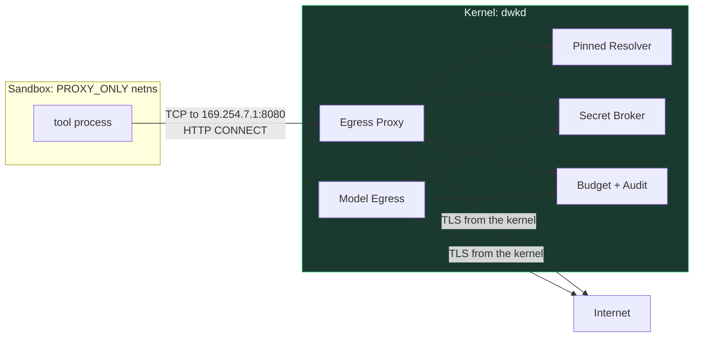

# Network Security

**Network permission is independent of execution permission.** A process allowed to run is not thereby allowed to talk. This separation is the reason an injected `curl` in a sandboxed build step does not become an exfiltration channel.

---

## 1. Topology



### Two distinct egress paths, and why

An earlier draft gave the sandbox *no* network interface and routed everything through "a Unix domain socket into the kernel's proxy, speaking HTTP CONNECT / SOCKS5." **That is unbuildable.** No mainstream HTTP client can address a proxy over a Unix socket: `http_proxy`/`https_proxy` take `host:port`, and curl, git, pip, npm, cargo, `requests` and Go's `net/http` all require a TCP endpoint. As written, `network.http` from a sandboxed tool simply would not have worked.

The same draft had the proxy "terminate TLS itself when credential injection or response inspection is required," which needs a DireWolf CA in the sandbox trust store (absent from the `oci-strict` profile) and breaks every client carrying its own bundle — pip/certifi, Node, Go, cargo. Two unbuildable mechanisms stacked on each other.

The replacement separates what was conflated:

| Path | Who initiates | Mechanism | Credential injection | Response inspection |
|---|---|---|---|---|
| **`net.http` tool** | the agent, explicitly | **Kernel performs the request itself.** No proxy involved. Result returns as an artifact. | **Yes** — mode (A) | Yes: size cap, MIME, redaction, artifact spill |
| **Sandbox egress** | a process the agent exec'd (`npm`, `pip`, `git`, `cargo`) | CONNECT proxy on a **TCP listener inside the sandbox's own network namespace** | **No** | No — opaque tunnel, byte-capped |

The sandbox gets a minimal private network namespace: a veth pair, no default route, no DNS resolver, and exactly one reachable peer — `169.254.7.1:8080`, the kernel's CONNECT proxy — injected as `HTTP_PROXY`/`HTTPS_PROXY`/`NO_PROXY` and the equivalent per-tool config. Everything else is unroutable. A process that ignores the proxy variables has no connectivity, which remains the correct failure mode.

**The tunnel is opaque, and we say so.** For proxied traffic the kernel enforces the destination host (from the CONNECT target and the TLS SNI, which must agree), the resolved IP (§3 guard), the port, byte budgets and connection counts. It does **not** see paths, headers, bodies or responses, and it injects no credentials. That is a real reduction in visibility compared with the original design, and it is the price of the original design being impossible. Credential-bearing requests go through `net.http`, where the kernel is the client and therefore sees everything.

This also resolves a product problem: `npm install`, `pip install` and `cargo fetch` work against allowlisted registry hosts, which the earlier "all allowlisted executables get `network_deny`" rule made impossible.

The runtime process likewise has no sockets (enforced by banned-import lint *and* by running it under a network-restricted profile where the platform supports it).

## 2. Decision pipeline per connection

```
1. Capability check      network.{http,https,tcp}:<host>:<port> covers this request?
2. Normalise host        IDNA/punycode → A-label; NFC; reject mixed-script confusables
                         for hosts not on an explicit allowlist; strip trailing dot
3. Resolve               kernel resolver, DNSSEC where available, result CACHED and PINNED
4. IP guard              reject the reserved ranges in §3 unless explicitly authorised
5. Policy                host, port, protocol, method, taint level, origin
6. Approval              if required
7. Budget                requests, bytes in/out
8. Connect               to the PINNED IP, not by re-resolving the name
9. TLS                   kernel-side; SNI and Host must equal the checked name
10. Credential injection secret broker, bound to this origin only
11. Stream               with byte accounting; abort on cap
12. Redirect             each hop re-enters at step 2 with a hop counter
13. Response             size cap, MIME classification, artifact spill, redaction
14. Audit
```

### DNS rebinding

Step 3 pins the resolved address set and step 8 connects to a pinned address. The name is resolved **once** and the connection uses that result, so a second resolution returning `127.0.0.1` cannot occur. Additionally:

- TTLs below a floor (30 s) are clamped upward for pinning purposes.
- A name resolving to *both* public and private addresses is rejected outright rather than filtered, because that pattern is almost exclusively a rebinding attack.
- The pin is scoped to the request, including all redirect hops.

## 3. Blocked address ranges

Denied by default for any agent-initiated request:

| Range | Why |
|---|---|
| `127.0.0.0/8`, `::1` | Loopback — reaches other services on the host |
| `169.254.0.0/16`, `fe80::/10` | Link-local — includes **cloud metadata (`169.254.169.254`)** |
| `fd00:ec2::254` | AWS IMDSv6 metadata |
| `10/8`, `172.16/12`, `192.168/16`, `fc00::/7` | RFC1918 / ULA — internal network pivot |
| `100.64.0.0/10` | CGNAT — Tailscale/WireGuard overlays |
| `0.0.0.0/8`, `::/128` | This-network |
| `224.0.0.0/4`, `ff00::/8` | Multicast |
| `240.0.0.0/4` | Reserved |
| `192.0.0.0/24`, `192.0.2.0/24`, `198.18/15`, `198.51.100/24`, `203.0.113/24` | Special-use / documentation |
| IPv4-mapped IPv6 (`::ffff:0:0/96`) of any blocked range | Bypass vector |
| NAT64 (`64:ff9b::/96`) of any blocked range | Bypass vector |

Metadata endpoints additionally get hostname-level blocks (`metadata.google.internal`, `metadata.goog`, `instance-data`) so a DNS-level trick cannot reach them.

Unblocking requires `security.allow_private_network` **plus** an explicit host/CIDR allowlist entry **plus** a capability. Three independent steps, because "let the agent reach my LAN" is a decision people should make once, deliberately, and see in `direwolf doctor` afterwards.

## 4. Protocol handling

- **HTTPS from a sandboxed process** is an opaque `CONNECT` tunnel. The kernel checks the CONNECT target host, requires the TLS SNI to match it, applies the IP guard to the resolved address, and enforces byte and connection budgets at the socket. It does not terminate TLS, does not inspect content, and injects no credentials. **There is no DireWolf CA and nothing is installed into any trust store.**
- **HTTPS initiated by the agent** (`net.http`) is performed by the kernel as the TLS client, so the full pipeline applies: credential injection, response size caps, MIME classification, redaction, artifact spill.
- **Plain HTTP** is denied by default; permitting it requires an explicit capability, because it leaks content to the local network.
- **Raw TCP** requires `network.tcp` with an explicit host:port and is denied in `SAFE` and `BALANCED`.
- **UDP, ICMP, raw sockets** are unavailable — the sandbox's namespace has no route to anything but the proxy endpoint, and the proxy speaks only stream protocols.
- **WebSocket** upgrades are permitted only where the origin is allowlisted and are subject to the same byte budgets; message-level inspection is not attempted.
- **DNS** is never reachable directly; only the kernel resolver answers, and only for names the request pipeline is already processing.

## 5. Credential binding to origin

Each credential handle declares the origins it may be injected into:

```toml
[secrets.github-primary]
type     = "bearer"
origins  = ["api.github.com", "uploads.github.com"]
header   = "Authorization"
prefix   = "Bearer "
```

The kernel **refuses to inject a credential into a request to any other origin**, including after a redirect. This directly addresses the failure class where an OpenAI-compatible transport could send provider credentials to a user-configured endpoint that was not the intended one: here, configuring a custom `base_url` does not carry the credential with it unless the origin is listed, and listing it is an explicit, audited act.

Redirects are the subtle part: a 302 from an allowlisted origin to a non-allowlisted one drops the credential header, and the destination must independently pass steps 1–7. Credentials never survive a cross-origin redirect.

## 6. Model egress

Model calls are not proxied traffic; they are a distinct kernel service, because the kernel must parse the response to meter it.

**`ModelCall` carries a typed structure, not an opaque body.** An earlier draft had the runtime adapter build a complete `HttpRequestSpec` — headers and body — which the kernel forwarded after checking only the upstream origin. That quietly made `model.call` a transitive, unpoliced, bidirectional network capability: a run holding *no* `network.*` could POST attacker-chosen bytes to an allowlisted vendor endpoint and read the reply, bypassing the egress pipeline, byte budgets, output capping and redaction. The capability grammar never said `model.call` implied network access, and it should not have to.

```
ModelCall { provider_profile_id, model, messages[], tool_schemas[], sampling_params,
            privacy_class, run_id, budget_lease }
  → kernel renders the provider request from the profile + this structure
  → kernel validates: upstream ∈ profile.origins
                      privacy_class permits this upstream
                      capability model.call:<provider>/<model> held
                      budget available
  → inject credential (origin-bound)
  → HTTPS from kernel
  → stream relay to runtime, with usage extraction
  → debit ledger, audit
```

**Privacy class enforcement:**

| Class | Permitted upstreams |
|---|---|
| `LOCAL_ONLY` | loopback-bound local inference only (the one authorised exception to the loopback block, scoped to a configured port) |
| `VENDOR_OK` | configured vendor list |
| `ANY` | any allowlisted model origin |

A run's class is set at admission from policy and the workspace's sensitivity label, and cannot be changed mid-run by anything the agent does. The runtime may *request* a model; the kernel decides whether the content may go there. This is what makes "this repository must not leave the machine" a guarantee rather than an intention.

**Usage extraction** is declarative per provider profile:

```toml
[providers.anthropic]
origins = ["api.anthropic.com"]
usage.input_tokens  = "/usage/input_tokens"
usage.output_tokens = "/usage/output_tokens"
usage.cache_read    = "/usage/cache_read_input_tokens"
stream_usage_event  = "message_delta"
```

Keeping this as JSON pointers in config rather than code keeps provider knowledge out of the kernel's Rust surface.

Request rendering is the mirror image: the profile declares path, method, header set and a body template, and the kernel fills it from the typed `ModelCall`. The runtime chooses *what to say*; the profile decides *how it is said*; neither can add a header or reach a different endpoint. Response bodies are subject to the same size caps, artifact spill and redaction as any other content crossing TB1->TB2 — a provider is untrusted for output ([THREAT_MODEL.md](THREAT_MODEL.md) T6), and before this change its response was the one input that skipped all of it.

## 7. Channel egress

*(The threat here is described in [ARCHITECTURE.md](ARCHITECTURE.md) §27 and [THREAT_MODEL.md](THREAT_MODEL.md) AC-7: chat platforms fetch URLs to build link previews, so emitting a URL is itself an exfiltration primitive.)*

Outbound agent content is processed before delivery:

```
1. Extract every URL-shaped token: markdown links, bare URLs, markdown images,
   HTML img/src/href in rich channels, attachment metadata, and any URL inside
   a code fence that the platform still auto-links
2. For each: normalise + resolve as in §2 steps 2–4
3. Evaluate against the run's network capability and the channel-egress policy
4. If the run is EXTERNAL_UNTRUSTED tainted and the URL is novel → REQUIRE_APPROVAL
5. Disallowed URLs are rendered INERT — scheme stripped, wrapped in a visible marker:
     [blocked-url: paste.example.com/aHR0cHM6…]
   never silently dropped, because silent modification hides an attack in progress
6. Audit every blocked URL with its provenance chain
```

Additional controls: query-string length limits on outbound URLs (a 4 KB query string to a novel host is exfiltration, whatever it claims to be); data-URI and `javascript:` schemes always inert; and per-run counters on distinct outbound destinations, since fan-out to many novel hosts is itself a signal.

This costs a little convenience — an agent that legitimately wants to send you a link to a new site will sometimes ask. That is the correct trade for closing a channel that tool-level permission models cannot see at all.

## 8. Budgets, breakers, failure

- Per-run: max requests, max bytes in/out, max distinct hosts, max redirect hops (default 5), per-request timeout, total network wall-clock.
- Per-origin circuit breaker: `healthy → degraded → unavailable`, half-open probes, jittered exponential backoff. No retry storms.
- Rate limits per origin honour `Retry-After`.
- **Failure is closed**: proxy unavailable, resolver failure, budget exhausted, or ambiguous policy all produce a denial with a specific reason, never a fallback direct connection. There is no direct connection to fall back to.

## 9. Eval suite

Included in the security evals, with acceptance "denied and audited":

SSRF to each blocked range · cloud metadata by IP, by hostname, via redirect, via IPv4-mapped IPv6, via NAT64 · DNS rebinding with a 1-second TTL · a name resolving to both public and private addresses · credential leakage via cross-origin redirect · `Host`/SNI mismatch · protocol smuggling in a CONNECT target · exfiltration via chat link preview · exfiltration via markdown image embed · oversized query string to a novel host · direct socket attempt from inside a `PROXY_ONLY` sandbox (bypassing the proxy endpoint) · direct DNS query from inside the sandbox · WebSocket to a non-allowlisted origin · `LOCAL_ONLY` run attempting a vendor model call.
