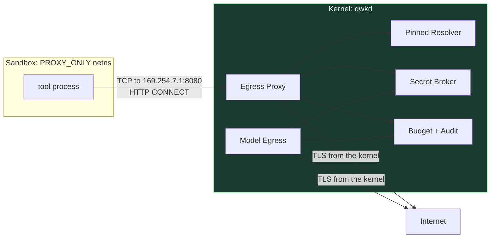

# Network Security

**Network permission is independent of execution permission.** A process allowed to run is not thereby allowed to talk. This separation is the reason an injected `curl` in a sandboxed build step does not become an exfiltration channel.

---

## 1. Topology


```mermaid
flowchart LR
  subgraph SBX["Sandbox: PROXY_ONLY netns"]
    P["tool process"]
  end
  subgraph K["Kernel: dwkd"]
    PX["Egress Proxy"]
    RES["Pinned Resolver"]
    ME["Model Egress"]
    SB["Secret Broker"]
    LG["Budget + Audit"]
  end
  I["Internet"]
  P -->|"TCP to 169.254.7.1:8080<br/>HTTP CONNECT"| PX
  PX --> RES
  PX --> SB
  PX --> LG
  PX -->|"TLS from the kernel"| I
  ME --> SB
  ME --> LG
  ME -->|"TLS from the kernel"| I

  style K fill:#1b3a2f,stroke:#4ade80,color:#e6ffef
```

### Two distinct egress paths, and why

An earlier draft gave the sandbox *no* network interface and routed everything through "a Unix domain socket into the kernel's proxy, speaking HTTP CONNECT / SOCKS5." **That is unbuildable.** No mainstream HTTP client can address a proxy over a Unix socket: `http_proxy`/`https_proxy` take `host:port`, and curl, git, pip, npm, cargo, `requests` and Go's `net/http` all require a TCP endpoint. As written, `network.http` from a sandboxed tool simply would not have worked.

The same draft had the proxy "terminate TLS itself when credential injection or response inspection is required," which needs a DireWolf CA in the sandbox trust store (absent from the `oci-strict` profile) and breaks every client carrying its own bundle — pip/certifi, Node, Go, cargo. Two unbuildable mechanisms stacked on each other.

The replacement separates what was conflated:

| Path | Who initiates | Mechanism | Credential injection | Response inspection |
|---|---|---|---|---|
| **`net.http` tool** | the agent, explicitly | **Kernel performs the request itself.** No proxy involved. Result returns as an artifact. | **Yes** — mode (A) | Yes: size cap, MIME, redaction, artifact spill |
| **Sandbox egress** | a process the agent exec'd (`npm`, `pip`, `git`, `cargo`) | CONNECT proxy on a **TCP listener inside the sandbox's own network namespace** | **No** | No — opaque tunnel, byte-capped |

The sandbox gets a minimal private network namespace: a veth pair, no default route, no DNS resolver, and exactly one reachable peer — `169.254.7.1:8080`, the kernel's CONNECT proxy — injected as `HTTP_PROXY`/`HTTPS_PROXY`/`NO_PROXY` and the equivalent per-tool config. Everything else is unroutable. A process that ignores the proxy variables has no connectivity, which remains the correct failure mode.

**As built in M5b** ([ADR-0048](adr/0048-m5b-proxy-only-topology-and-connect-proxy.md)): not a veth pair but fewer peers still — the runtime's `none` network (loopback only), `169.254.7.1/32` added to that loopback by a one-shot setup container, and an unprivileged relay in the same namespace forwarding each connection, unread, to the broker's per-environment socket — whose directory's ACL lets only the relay's uid reach it. There is no route at all. The variables are `HTTP_PROXY`, `HTTPS_PROXY`, `ALL_PROXY` and `NO_PROXY` in both cases; per-tool configuration is not written — package-manager routing is M5d's. The proxy is the broker's (the "Egress Proxy" above), on the host. Measured: every external, metadata, host-gateway, LAN, link-local, IPv6, IPv4-mapped and NAT64 destination fails `ENETUNREACH`; the proxy address on any other port `ECONNREFUSED`; raw and packet sockets `EPERM` (no capability); a virtual socket `EPERM` (seccomp); an ICMP echo `ENETUNREACH`; no resolver answers.

**How the probe judges a path (M5b, as built — `dwk-sandbox-probe/src/network.rs`).** Refused means the kernel refused the attempt before anything left (`ENETUNREACH`, a permission, a family). Anything else is a path and fails the invariant whether or not anything replies: a connection, a datagram the kernel accepted, a connect still pending when its time runs out, a reset from anywhere but the namespace's own loopback, a neighbour that never answered (`EHOSTUNREACH`), and a route to a resolver outside the namespace. The attempts are bounded however the namespace routes: each invariant has its own deadline (8 s for the proxy, 5 s each for direct egress and direct DNS — together within two thirds of the broker's 30 s probe step), the cheapest proof goes first (a datagram the kernel accepts proves a route without waiting), and the first failure decides the invariant. A deadline that passes undecided is `UNOBSERVABLE`, never `PASS`. (The first hosted run of M5b lost the whole report on a runner whose network leaves some destinations silent: the attempts, one after another, outlasted the step.)

**What the proxy sees (M5b, as built):** the CONNECT host and port, the resolved addresses, the TLS server name, connection metadata and timing, and byte counts. **What it does not:** the HTTP path, headers, body or response inside TLS, the encrypted `Host`, and any credential inside TLS. Its audit and events carry dispositions and counts, never a payload.

**As built in M5c (in progress, pending acceptance — [ADR-0050](adr/0050-m5c-kernel-performed-net-http-ssrf-redirects-and-credential-egress.md)).** `net.http` never touches the tunnel: the authority decides every hop, the broker is the TLS client to addresses the guard pinned for the request — it dials, and a one-hop exchange worker (`dwkd-broker http-worker`, handed only that connection, that credential and that hop) runs the TLS and HTTP and is gone before the broker answers (ADR-0050 §9, D11) — and the `PROXY_ONLY` relay and CONNECT proxy are unchanged (no TLS stack, no credential, no `net.http` code in `egress/`; TX038, TX044). The result is returned inline — status, the keep-list's headers, the body redacted and bounded at 256 KiB, every hop — not as an artifact: MIME classification and artifact spill are M12's.

**The tunnel is opaque, and we say so.** For proxied traffic the kernel enforces the destination host (from the CONNECT target and the TLS SNI, which must agree), the resolved IP (§3 guard), the port, byte budgets and connection counts. It does **not** see paths, headers, bodies or responses, and it injects no credentials. That is a real reduction in visibility compared with the original design, and it is the price of the original design being impossible. Credential-bearing requests go through `net.http`, where the kernel is the client and therefore sees everything.

**Residual: domain fronting.** Because the kernel sees the SNI and not the request inside the tunnel, a process in the sandbox can reach any origin served from the same front as an allowlisted host — a CDN or a large shared platform — by naming the allowed host in the SNI and another in the encrypted `Host` header. An allowlist entry for a broad shared host is therefore an allowlist entry for everything behind it. The mitigations are narrow allowlist entries, the tunnel's byte budget and connection count, and keeping every credential-bearing request on `net.http`; M5b's egress evidence shows exactly that: a request naming another origin inside an agreeing tunnel is carried unseen, and the environment's upload budget stops it at the byte. (Recorded from the limits another sandbox documents for itself: [COMPETITIVE_ANALYSIS.md](COMPETITIVE_ANALYSIS.md) §17 G7.)

This also resolves a product problem: `npm install`, `pip install` and `cargo fetch` work against allowlisted registry hosts, which the earlier "all allowlisted executables get `network_deny`" rule made impossible.

The runtime process likewise has no sockets (enforced by banned-import lint *and* by running it under a network-restricted profile where the platform supports it). The lint is development hygiene; the launch profile is the control, and it is **M9's**: the runtime is started with no network route — on Linux, Unix-domain sockets only, or an empty network namespace — and a CI job verifies from the real runtime identity that TCP, UDP, raw and packet sockets and DNS all fail while the authority socket connects ([COMPETITIVE_ANALYSIS.md](COMPETITIVE_ANALYSIS.md) §17 G1). Not implemented yet: no runtime exists.

## 2. Decision pipeline per connection

```
1. Capability check      network.{http,https,tcp}:<host>:<port> covers this request?
2. Normalise host        IDNA/punycode → A-label; NFC; reject mixed-script confusables
                         for hosts not on an explicit allowlist; strip trailing dot
3. Resolve               kernel resolver, DNSSEC where available, result CACHED and PINNED
4. IP guard              reject the reserved ranges in §3 unless explicitly authorised
5. Policy                host, port, protocol, method, taint level, origin
6. Approval              if required
7. Budget                requests, bytes in/out
8. Connect               to the PINNED IP, not by re-resolving the name
9. TLS                   kernel-side; SNI and Host must equal the checked name
10. Credential injection secret broker, bound to this origin only
11. Stream               with byte accounting; abort on cap
12. Redirect             each hop re-enters at step 2 with a hop counter
13. Response             size cap, MIME classification, artifact spill, redaction
14. Audit
```

**For sandbox egress (M5b, as built — [ADR-0048](adr/0048-m5b-proxy-only-topology-and-connect-proxy.md) §§4–7)** the pipeline is the proxy's: a strict CONNECT parse, the run's own exact `network.https` grants (a wildcard grants no tunnel), metadata names refused, the tunnel limit, one resolution by the host's resolver under a deadline, the whole answer guarded, `200`, a strict `ClientHello` whose one server name is the CONNECT host (ECH refused; TLS only), the pinned address dialled, and environment-wide byte budgets at the socket. Credential injection, redirects and response handling are `net.http`'s (M5c).

**For `net.http` (M5c, as built — [ADR-0050](adr/0050-m5c-kernel-performed-net-http-ssrf-redirects-and-credential-egress.md) §5)** the pipeline is the authority's, per hop: the URL canonicalised by the one shared parser (an `https` URL with one reading: no userinfo, literal, uppercase, trailing dot, encoded dot segment, backslash or fragment), metadata names refused, the caller's headers judged against an allowlist with every configured credential header reserved, a configured secret's value anywhere in the request refused; `network.https:<host>:<port>?methods=<m>&max_requests=<n>` and, when a credential is named, `secret.use:<handle>` through both gates — **nothing resolved for a host no grant covers, nor when a decision that needs no address already denies**; one resolution by the broker's resolver, the whole answer judged by the broker and again by the authority with the same function; policy evaluated for **every** pinned address; budgets charged before sending; the intent durable; the exchange to the pinned addresses only; the outcome durable and the run tainted before anything is followed or answered. A redirect is a new hop decided from the start: at most five, never a downgrade, never a loop, never a body resent (`303` becomes a `GET`), never the caller's headers or the credential across origins.

### DNS rebinding

Step 3 pins the resolved address set and step 8 connects to a pinned address. The name is resolved **once** and the connection uses that result, so a second resolution returning `127.0.0.1` cannot occur. Additionally:

- TTLs below a floor (30 s) are clamped upward for pinning purposes.
- A name resolving to *both* public and private addresses is rejected outright rather than filtered, because that pattern is almost exclusively a rebinding attack.
- The pin is scoped to the request, including all redirect hops.
- **As built for `net.http` (M5c):** the pin is scoped to one request: every hop to a pinned host reuses its guarded answer, re-judged by the broker, and the next request resolves and is judged afresh (measured: a rebinding name's first request follows its same-host redirect without a second resolution; its next request gets the blocked answer and is refused).
- **As built for the M5b proxy:** the pin is scoped to one tunnel; the name is never re-resolved inside it, and the next tunnel resolves and is judged afresh (measured: a rebinding name's first tunnel reaches the pinned origin, its second gets the blocked answer and is refused).

## 3. Blocked address ranges

Denied by default for any agent-initiated request:

| Range | Why |
|---|---|
| `127.0.0.0/8`, `::1` | Loopback — reaches other services on the host |
| `169.254.0.0/16`, `fe80::/10` | Link-local — includes **cloud metadata (`169.254.169.254`)** |
| `fd00:ec2::254` | AWS IMDSv6 metadata |
| `10/8`, `172.16/12`, `192.168/16`, `fc00::/7` | RFC1918 / ULA — internal network pivot |
| `100.64.0.0/10` | CGNAT — Tailscale/WireGuard overlays |
| `0.0.0.0/8`, `::/128` | This-network |
| `224.0.0.0/4`, `ff00::/8` | Multicast |
| `240.0.0.0/4` | Reserved |
| `192.0.0.0/24`, `192.0.2.0/24`, `198.18/15`, `198.51.100/24`, `203.0.113/24` | Special-use / documentation |
| IPv4-mapped IPv6 (`::ffff:0:0/96`) of any blocked range | Bypass vector |
| NAT64 (`64:ff9b::/96`) of any blocked range | Bypass vector |

**As built in M5c:** the guard is one pure function over octets in `dwk_proto::wire::guard`, called by the CONNECT proxy, by `net.http`'s broker side and by the authority — the same table, judged twice for every `net.http` answer; TX048 refuses a second range table anywhere else. **As built in M5b** (the proxy's guard, `dwkd-broker/src/egress/guard.rs`, now an adapter over the shared function): the table above, plus the 6to4 relay anycast (`192.88.99.0/24`); IPv6 is reachable only within `2000::/3`, minus documentation (`2001:db8::/32`, `3fff::/20`), discard (`100::/64`) and `2001::/23` (Teredo included); NAT64 and 6to4 addresses are judged by the IPv4 address they embed; IPv4-mapped and IPv4-compatible addresses are blocked outright. Production has no unblocking mechanism at all; the three-step unblocking below is not built. The guard judges ranges, not the host: a granted name that resolves to a public address of the host itself, or of its own network, passes it, and is reachable on the granted port with the granted server name.

Metadata endpoints additionally get hostname-level blocks (`metadata.google.internal`, `metadata.goog`, `instance-data`) so a DNS-level trick cannot reach them.

Unblocking requires `security.allow_private_network` **plus** an explicit host/CIDR allowlist entry **plus** a capability. Three independent steps, because "let the agent reach my LAN" is a decision people should make once, deliberately, and see in `direwolf doctor` afterwards.

## 4. Protocol handling

- **HTTPS from a sandboxed process** is an opaque `CONNECT` tunnel. The kernel checks the CONNECT target host, requires the TLS SNI to match it, applies the IP guard to the resolved address, and enforces byte and connection budgets at the socket. It does not terminate TLS, does not inspect content, and injects no credentials. **There is no DireWolf CA and nothing is installed into any trust store.**
- **HTTPS initiated by the agent** (`net.http`) is performed by the kernel as the TLS client, so the full pipeline applies: credential injection, response size caps, MIME classification, redaction, artifact spill. *As built in M5c:* credential injection at the bound origin only, the 256 KiB response bound (narrowed by `max_output_bytes` and the call), header allowlist, `Set-Cookie` dropped, no decoding, redaction; MIME classification and artifact spill wait for M12. An echo of the credential is taken out by the broker before anything of the response is encoded, and audited as a count. Residual, pending the owner's acceptance: an origin that echoes the credential can leave it in the broker's TLS and HTTP libraries' freed memory — never in a message, the audit, the authority or the runtime's answer (ADR-0050 §20, D11).
- **Plain HTTP** is denied by default; permitting it requires an explicit capability, because it leaks content to the local network.
- **Raw TCP** requires `network.tcp` with an explicit host:port and is denied in `SAFE` and `BALANCED`.
- **UDP, ICMP, raw sockets** are unavailable — the sandbox's namespace has no route to anything but the proxy endpoint, and the proxy speaks only stream protocols.
- **WebSocket** upgrades are permitted only where the origin is allowlisted and are subject to the same byte budgets; message-level inspection is not attempted.
- **DNS** is never reachable directly; only the kernel resolver answers, and only for names the request pipeline is already processing.

## 5. Credential binding to origin

Each credential handle declares the origins it may be injected into:

```toml
[secrets.github-primary]
type     = "bearer"
origins  = ["api.github.com", "uploads.github.com"]
header   = "Authorization"
prefix   = "Bearer "
```

The kernel **refuses to inject a credential into a request to any other origin**, including after a redirect. This directly addresses the failure class where an OpenAI-compatible transport could send provider credentials to a user-configured endpoint that was not the intended one: here, configuring a custom `base_url` does not carry the credential with it unless the origin is listed, and listing it is an explicit, audited act.

Redirects are the subtle part: a 302 from an allowlisted origin to a non-allowlisted one drops the credential header, and the destination must independently pass steps 1–7. Credentials never survive a cross-origin redirect.

## 6. Model egress

Model calls are not proxied traffic; they are a distinct kernel service, because the kernel must parse the response to meter it.

**`ModelCall` carries a typed structure, not an opaque body.** An earlier draft had the runtime adapter build a complete `HttpRequestSpec` — headers and body — which the kernel forwarded after checking only the upstream origin. That quietly made `model.call` a transitive, unpoliced, bidirectional network capability: a run holding *no* `network.*` could POST attacker-chosen bytes to an allowlisted vendor endpoint and read the reply, bypassing the egress pipeline, byte budgets, output capping and redaction. The capability grammar never said `model.call` implied network access, and it should not have to.

```
ModelCall { provider_profile_id, model, messages[], tool_schemas[], sampling_params,
            privacy_class, run_id, budget_lease }
  → kernel renders the provider request from the profile + this structure
  → kernel validates: upstream ∈ profile.origins
                      privacy_class permits this upstream
                      capability model.call:<provider>/<model> held
                      budget available
  → inject credential (origin-bound)
  → HTTPS from kernel
  → stream relay to runtime, with usage extraction
  → debit ledger, audit
```

**Privacy class enforcement:**

| Class | Permitted upstreams |
|---|---|
| `LOCAL_ONLY` | loopback-bound local inference only (the one authorised exception to the loopback block, scoped to a configured port) |
| `VENDOR_OK` | configured vendor list |
| `ANY` | any allowlisted model origin |

A run's class is set at admission from policy and the workspace's sensitivity label, and cannot be changed mid-run by anything the agent does. The runtime may *request* a model; the kernel decides whether the content may go there. This is what makes "this repository must not leave the machine" a guarantee rather than an intention.

**Usage extraction** is declarative per provider profile:

```toml
[providers.anthropic]
origins = ["api.anthropic.com"]
usage.input_tokens  = "/usage/input_tokens"
usage.output_tokens = "/usage/output_tokens"
usage.cache_read    = "/usage/cache_read_input_tokens"
stream_usage_event  = "message_delta"
```

Keeping this as JSON pointers in config rather than code keeps provider knowledge out of the kernel's Rust surface.

Request rendering is the mirror image: the profile declares path, method, header set and a body template, and the kernel fills it from the typed `ModelCall`. The runtime chooses *what to say*; the profile decides *how it is said*; neither can add a header or reach a different endpoint. Response bodies are subject to the same size caps, artifact spill and redaction as any other content crossing TB1->TB2 — a provider is untrusted for output ([THREAT_MODEL.md](THREAT_MODEL.md) T6), and before this change its response was the one input that skipped all of it.

## 7. Channel egress

*(The threat here is described in [ARCHITECTURE.md](ARCHITECTURE.md) §27 and [THREAT_MODEL.md](THREAT_MODEL.md) AC-7: chat platforms fetch URLs to build link previews, so emitting a URL is itself an exfiltration primitive.)*

Outbound agent content is processed before delivery:

```
1. Extract every URL-shaped token: markdown links, bare URLs, markdown images,
   HTML img/src/href in rich channels, attachment metadata, and any URL inside
   a code fence that the platform still auto-links
2. For each: normalise + resolve as in §2 steps 2–4
3. Evaluate against the run's network capability and the channel-egress policy
4. If the run is EXTERNAL_UNTRUSTED tainted and the URL is novel → REQUIRE_APPROVAL
5. Disallowed URLs are rendered INERT — scheme stripped, wrapped in a visible marker:
     [blocked-url: paste.example.com/aHR0cHM6…]
   never silently dropped, because silent modification hides an attack in progress
6. Audit every blocked URL with its provenance chain
```

Additional controls: query-string length limits on outbound URLs (a 4 KB query string to a novel host is exfiltration, whatever it claims to be); data-URI and `javascript:` schemes always inert; and per-run counters on distinct outbound destinations, since fan-out to many novel hosts is itself a signal.

This costs a little convenience — an agent that legitimately wants to send you a link to a new site will sometimes ask. That is the correct trade for closing a channel that tool-level permission models cannot see at all.

## 8. Budgets, breakers, failure

- Per-run: max requests, max bytes in/out, max distinct hosts, max redirect hops (default 5), per-request timeout, total network wall-clock.
- Per-origin circuit breaker: `healthy → degraded → unavailable`, half-open probes, jittered exponential backoff. No retry storms.
- Rate limits per origin honour `Retry-After`.
- **Failure is closed**: proxy unavailable, resolver failure, budget exhausted, or ambiguous policy all produce a denial with a specific reason, never a fallback direct connection. There is no direct connection to fall back to.

## 9. Eval suite

Included in the security evals, with acceptance "denied and audited":

SSRF to each blocked range · cloud metadata by IP, by hostname, via redirect, via IPv4-mapped IPv6, via NAT64 · DNS rebinding with a 1-second TTL · a name resolving to both public and private addresses · credential leakage via cross-origin redirect · `Host`/SNI mismatch · protocol smuggling in a CONNECT target · exfiltration via chat link preview · exfiltration via markdown image embed · oversized query string to a novel host · direct socket attempt from inside a `PROXY_ONLY` sandbox (bypassing the proxy endpoint) · direct DNS query from inside the sandbox · WebSocket to a non-allowlisted origin · `LOCAL_ONLY` run attempting a vendor model call.
