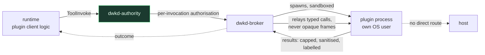

# Plugins and Extensions

**Status: deferred past V1.** This document fixes the trust model now so that V1's interfaces do not have to be renegotiated when plugins arrive.

---

## 1. Why deferred

A plugin system is the fastest way to undo a security architecture. The failure is well documented in comparable systems: *"native plugins run in-process and are not sandboxed"* — at which point installing a plugin grants it everything the host process has, and the capability model becomes decorative.

We would rather ship V1 with fewer extension points than ship one that silently voids the boundary. Extension in V1 happens through MCP (already sandboxed and capability-scoped) and skills (already validated). Those cover most of what plugins are usually used for.

## 2. The rule

> **A plugin receives no authority by being installed.**
>
> Installation registers declarations. Authority arrives only through capabilities the operator grants, and every side effect still traverses the kernel.

Corollary: **out-of-process by default.** A plugin that needs to run in the runtime's address space is a plugin that needs the runtime's authority, and there is no version of that we are willing to ship as a default.

## 3. Manifest

```toml
schema_version = 1

[plugin]
id          = "acme.jira"
version     = "2.1.0"
api_version = "1.x"                  # DireWolf plugin API compatibility range
publisher   = "acme"
homepage    = "https://..."
description = "Jira issue management"

[requires]
capabilities = ["network.https:acme.atlassian.net:443",
                "secret.use:jira-token"]
host_api     = ["tools.register", "events.subscribe:run.completed"]

[[contributes.tools]]
name        = "jira.search"
args_schema = "schemas/search.json"
side_effect = "READ"
risk        = "LOW"

[[contributes.tools]]
name        = "jira.transition"
args_schema = "schemas/transition.json"
side_effect = "EXTERNAL"
risk        = "MEDIUM"
retry       = "RETRY_WITH_KEY"

[runtime]
kind        = "process"              # process | wasm ; "inprocess" is not a value
entrypoint  = "bin/acme-jira"
protocol    = "direwolf-plugin/1"

[integrity]
content_hash = "sha256:..."
signature    = "..."
sbom         = "sbom.spdx.json"
```

`kind = "inprocess"` is not an accepted value. There is no escape hatch, because an escape hatch in a trust boundary is just a door.

## 4. Hosting



A plugin process is spawned **by `dwkd-broker` under an authorisation from `dwkd-authority`**, sandboxed like any other execution, with its own capability set. As with MCP ([ADR-0018](adr/0018-authority-broker-split.md), [PROTOCOL.md](PROTOCOL.md) §2), the kernel owns the plugin protocol rather than relaying opaque frames — a relayed frame the kernel does not interpret is a second path to effect. It has no network unless granted, no filesystem beyond what it declared, and no credentials — a plugin needing an API token gets egress injection ([SECRETS.md](SECRETS.md) mode A), so the token at rest exists only inside `dwkd-authority`.

Crucially, a plugin's tool *results* are untrusted content subject to the same size caps, sanitisation and provenance labelling as any other tool output. A plugin is a tool provider, not a peer.

**WASM** is a candidate second host for pure-computation plugins: strong isolation, no process overhead, deterministic. Reserved, not committed.

## 5. Capability grant at install

```console
$ direwolf plugin install acme.jira@2.1.0
  Publisher  acme        signature VERIFIED
  Integrity  sha256 3f2a…  OK
  SBOM       47 dependencies, 0 known advisories

  Requests:
    network.https:acme.atlassian.net:443    → your agent may already have this
    secret.use:jira-token                   → NOT CONFIGURED; create it or deny

  Contributes 2 tools:
    jira.search       READ      LOW
    jira.transition   EXTERNAL  MEDIUM   ← changes state in Jira

  Grant which capabilities? [a]ll [s]elect [n]one
```

Granting is per-plugin and per-capability, revocable, listed by `direwolf plugin list --capabilities`, and re-prompted when a new version requests more than the old one. **A version bump that widens requested capabilities is a re-consent event**, which is the rug-pull defence applied to plugins.

## 6. Host API surface

Deliberately small. Plugins may:

- register tools (declarations only; invocation still goes through the kernel)
- register channel adapters (edge plane; no authority)
- register model providers (request shaping only; the kernel still performs the call)
- register memory stores
- subscribe to a fixed set of lifecycle events

Plugins may **not**: read or write policy, mint or attenuate capabilities, create approvals, access the kernel socket, read secrets, register execution environments (privileged — kernel-side, in-tree, highest review bar), or modify another plugin.

The event subscription list is an allowlist. `run.completed` is fine; there is no `tool.about_to_execute` hook, because a hook on the enforcement path is a way to sit inside it.

## 7. Supply chain

| Control | Applies to |
|---|---|
| Signature verification | plugins, skills, container images |
| Content hash pinning | all of the above |
| SBOM required | plugins |
| Advisory scan at install and periodically | plugin dependencies |
| Lockfiles + pinned digests | DireWolf's own build |
| `cargo-deny` allowlist | kernel dependencies |
| Reproducible builds | kernel binary (target, not V1 guarantee) |
| No implicit updates | everything — an update is an operator action |

"No implicit updates" is load-bearing: auto-updating plugins means an attacker who compromises a publisher once compromises every installation without a single operator decision.

## 8. When plugins ship

Not before all of these hold:

1. The capability model has survived adversarial review and the security eval suite in a shipped release.
2. MCP integration has been running long enough to show whether plugins are even needed — MCP may cover the demand.
3. The out-of-process host protocol is versioned and compatibility-tested.
4. Signature verification and SBOM tooling exist end to end.
5. There is a documented process for revoking a compromised publisher.

Expected: V2. If MCP proves sufficient, **not shipping a plugin system is an acceptable outcome** and should be treated as a success rather than a gap.
