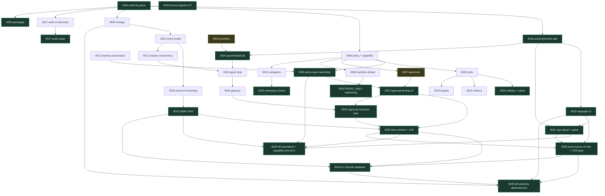

# Architecture Decision Records

Each ADR records one decision, the context that forced it, what it costs, what was rejected, and what would make us revisit it. An ADR without a "Revisit if" is an opinion wearing a costume.

**Accepted ADRs are immutable.** A changed decision produces a *new* ADR that supersedes or amends the old one; the old one stays, banner-marked, as a historical record. Phase 0.1 reconciliation produced twelve such ADRs (0018–0029) after adversarial review invalidated parts of the original set; M1 added 0030 (licence) and 0031 (repository layout and boundary enforcement); M2 added 0032 (the wire contract) and 0033 (protocol source of truth and TCB dependencies); the M2 closeout added 0034, which removed the protocol's dependence on a Unicode database; M3a added 0035 (what the authority plane is allowed to link) and 0036 (which DWKP operations M3 owns, and how a capability crosses the wire); M3b added 0037, which separates a capability as *declared* from a capability that authority is *compared with*; M3c added 0038, which gives policy an explicit second evaluation phase, restricts `extends` to a composition that cannot widen, and takes `would_require_approval` out of the caller's hands; M3d added 0039, which gives the authority durable state -- `kernel.db`, fenced epochs, durable admission, kernel-owned policy inputs and an audit chain written through a transactional outbox -- and records what that state costs the trusted computing base, SQLite's C included; the M3d reconciliation added 0040, which separates duplicate suppression from same-response replay across a tenure change, refuses a proposed action the authority cannot express as a complete canonical action instead of deciding it, and versions the three DWKP responses that changed; and M3e added 0041, which puts the authority behind a real process boundary -- a Unix-domain socket whose peers the kernel identifies before a byte is read, one fresh lease holder per connection, a handshake-first strict transport, and `rustix` in the measured TCB; and M4a added 0042, which decides what a declared filesystem path means -- the object found beneath an operator-bound root pinned by identity, by `openat2` relative to held descriptors, with symlinks, magic links, mount crossings and Unicode aliases refused, and the checked descriptor kept for the effect that M4b will perform; and M4b added 0043, which performs that effect -- `fs.read`, the first tool -- over a private channel on which the broker reads only from the authority's kernel-reported uid and the authority sends only to the broker's, with one read-only descriptor for the checked file, a single-use authorisation bound to a broker-issued channel instead of a MAC, a durable intent before the effect and a durable outcome and taint before the answer, and ADR-0018's blast-radius claim stated precisely; and M4c added 0044, which adds the other seven filesystem tools behind a canonical plan in which both gates decide every action, vacant targets as a second type, a broker that changes one validated name atomically and never an object it did not prove, a write permission for the broker's own uid stated as the ambient authority it is, and an `UNKNOWN` outcome that nothing ever performs again; and M4d added 0045, which adds process execution — an executable identity resolved from an absolute path and hashed, a broker that re-proves the descriptor the authority opened and executes that descriptor through a helper with an empty environment, limits and no surviving descriptor, bounded output, kill by pidfd and process group, broker generations — behind a host floor that needs a per-invocation approval, so that no production build launches anything before M6. **Do not cite a superseded ADR as current rationale.**

## Index

### Current (cite these)

| # | Decision | Relation |
|---|---|---|
| [0000](0000-authority-plane-separation.md) | The authority boundary is an OS process boundary | amended by 0018 |
| [0003](0003-agent-loop.md) | Two-dimensional run state — lifecycle state plus a wait set | — |
| [0009](0009-storage-strategy.md) | SQLite, two physically separate stores, no abstraction layer | — |
| [0010](0010-event-model.md) | Hybrid — relational entities, append-only transcript, chained audit | — |
| [0011](0011-session-concurrency.md) | Single-writer session actors with database leases and epoch fencing | — |
| [0014](0014-artifact-model.md) | Large output becomes a kernel-owned, content-addressed artifact | — |
| [0015](0015-plugin-trust-model.md) | No plugins in V1; out-of-process with granted capabilities thereafter | — |
| **[0018](0018-authority-broker-split.md)** | **The authority plane is two processes — `dwkd-authority` and `dwkd-broker`** | amends 0000; authorisation mechanism and blast-radius claim amended by 0043; process execution by the broker amended by 0045 |
| **[0019](0019-language-rationale-v2.md)** | **Language rationale, revised for the authority/broker split** | supersedes 0001; dependency set amended by 0033 |
| **[0020](0020-provider-request-path-v2.md)** | **Typed `ModelCall`; the kernel renders the provider request** | supersedes 0002 |
| **[0021](0021-approval-binding-v2.md)** | **Approval binding v2 — taint, privacy class and obligations are bound** | supersedes 0007; hash encoding amended by 0032 |
| **[0022](0022-approval-response-authentication.md)** | **Approval responses are authenticated independently of the relay** | amends 0004; MAC encoding amended by 0032 |
| **[0023](0023-dwkp-strict-schema.md)** | **DWKP rejects unknown fields; forward compatibility is for DWCP and the event log** | supersedes 0016 (DWKP part); made concrete by 0032 |
| **[0024](0024-sandbox-network-topology.md)** | **Sandbox networking is `PROXY_ONLY`, not `none`** | supersedes 0008 (network part) |
| **[0025](0025-subagent-workspace-clone.md)** | **Subagent repo workspaces are independent clones, not linked worktrees** | supersedes 0013 (workspace part) |
| **[0026](0026-tool-visibility-and-cache-stability.md)** | **Tool visibility is fixed at admission and may only narrow** | supersedes 0005 (timing part) |
| **[0027](0027-audit-scope-boundary.md)** | **Audit covers brokered effects, not activity inside an authorised exec** | amends 0017 |
| **[0028](0028-policy-input-ownership.md)** | **Every policy input is derived and stored kernel-side** | amends 0006, 0012 |
| **[0029](0029-packaging-runtime-first-decoupled-authority.md)** | **DireWolf ships as a complete runtime; the authority plane is decoupled but not a separate product** | — |
| [0030](0030-licence-apache-2.0.md) | DireWolf is licensed under Apache-2.0 | — |
| [0031](0031-repository-layout-and-boundary-enforcement.md) | Repository layout, and how architectural boundaries are enforced in the build | refines 0018, 0019 |
| **[0032](0032-wire-contract-framing-strict-json-and-jcs.md)** | **The wire contract: framing, strict JSON, and RFC 8785 as the one canonical encoding** | amends 0021, 0022, 0023; key rule amended by 0034 |
| **[0033](0033-protocol-source-of-truth-and-tcb-dependencies.md)** | **Rust → JSON Schema → Python; the dependencies `dwk-proto` brings into the TCB** | amends 0019; §4 superseded by 0034 |
| **[0034](0034-protocol-depends-on-no-unicode-database.md)** | **No protocol decision consults a Unicode database; DWKP's unknown-field rule carries the property** | amends 0032, 0033; refines 0023 |
| **[0035](0035-m3-authority-dependency-set.md)** | **The M3 authority dependency set: SQLite, TOML, peer credentials and SHA-256 enter the TCB** | amends 0019, 0033, 0034 |
| **[0036](0036-m3-authority-operations-and-the-capability-wire-form.md)** | **M3 defines AdmitRun, ReleaseRun and QueryAuthority; ToolInvoke stays reserved until a tool exists** | amends 0032; refines 0006, 0011, 0023, 0028, 0031 |
| **[0037](0037-capability-specifications-and-canonical-authority-identities.md)** | **A declared capability and an authority-comparable capability are different types** | refines 0006, 0036 |
| **[0038](0038-policy-evaluation-phases-and-composition.md)** | **Policy evaluates in two phases, composes only by narrowing, and derives `would_require_approval` itself** | refines 0006, 0028, 0035 |
| **[0039](0039-durable-authority-state.md)** | **Authority state is durable, fenced and audited before it is returned; the kernel owns every policy input it decides on** | amends 0019, 0035; refines 0009, 0010, 0011, 0017, 0028, 0036 |
| **[0040](0040-m3d-reconciliation-admission-across-tenures-and-undecidable-proposals.md)** | **An admission key outlives its run but never replays it; a proposal the authority cannot canonicalise is refused, not decided** | amends 0036, 0039; refines 0011, 0023 |
| **[0041](0041-m3e-authenticated-dwkp-transport.md)** | **The authority serves DWKP on a Unix-domain socket to peers the kernel identifies; one fresh lease holder per connection** | amends 0019; records 0035 §3; refines 0000, 0011, 0018, 0028, 0029, 0032, 0039 |
| **[0042](0042-m4a-canonical-filesystem-resolution.md)** | **A declared path means the object found beneath a pinned root, by descriptor, or nothing** | amends 0019, 0035, 0039; refines 0018, 0028, 0034, 0037, 0040 |
| **[0043](0043-m4b-private-broker-channel-and-brokered-fs-read.md)** | **The broker reads the object the authority checked, over a private channel only the authority can speak on** | amends 0018, 0036, 0039; refines 0028, 0032, 0037, 0040, 0041, 0042; private protocol, blast radius and retry decision amended by 0044; private protocol version 3 by 0045 |
| **[0044](0044-m4c-filesystem-operations-plans-and-atomic-mutation.md)** | **The filesystem tools: a canonical plan, every gate of every action, and atomic changes checked against the authorised object on both sides of the system call** | amends 0036, 0039, 0043; refines 0005, 0018, 0037, 0042; private protocol and blast radius amended by 0045 |
| **[0045](0045-m4d-process-execution-broker.md)** | **Process execution: the executable the authority hashed, executed from the descriptor the broker re-proved, and no production launch until approvals exist** | amends 0018, 0036, 0039, 0043, 0044; refines 0005, 0037, 0042 |

### Partially current (the unsuperseded parts still apply)

| # | Decision | What changed |
|---|---|---|
| [0004](0004-gateway-boundary.md) | The gateway is optional, holds no authority, and is four components | Approval-response authentication → 0022 |
| [0005](0005-tool-system.md) | Declarative registry, policy-driven visibility, no shell-string tool | Visibility *timing* → 0026 |
| [0006](0006-policy-and-capability-boundary.md) | Capabilities are the vocabulary; policy is the decision; both required | Input ownership → 0028 |
| [0008](0008-sandbox-default.md) | Sandboxed execution is the default; host execution is opt-in and loud | Network topology → 0024 |
| [0012](0012-memory-provenance.md) | Provenance gates promotion; memory can never alter authority | Storage of provenance → 0028 |
| [0013](0013-subagent-isolation.md) | Subagents are runs; capabilities attenuate; budgets are subtractive | Workspace mechanism → 0025 |
| [0016](0016-protocol-versioning.md) | Three protocols, additive evolution, forward-compatible readers | DWKP compatibility → 0023 |
| [0017](0017-observability-vs-audit.md) | Audit and telemetry are separate systems with different owners | Audit scope claim → 0027 |

### Superseded (historical record only)

| # | Decision | Superseded by |
|---|---|---|
| ~~[0001](0001-language-and-runtime.md)~~ | Controlled polyglot — Rust kernel, Python runtime, TypeScript UI | [0019](0019-language-rationale-v2.md) |
| ~~[0002](0002-provider-abstraction.md)~~ | Provider adapters shape requests; the kernel performs them | [0020](0020-provider-request-path-v2.md) |
| ~~[0007](0007-approval-semantics.md)~~ | Approvals bind to a canonical action, single-use, expiring, agent-bound | [0021](0021-approval-binding-v2.md) |

## Reading order

**ADR-0000 first, then ADR-0018.** Together they answer *why* there is an authority boundary and *where it is drawn*. Everything else is downstream.

If you read only four: **0000** (why a kernel exists), **0018** (how it is split), **0028** (what the kernel must own for policy to mean anything), **0021** (how a human grants an exception).

## Dependency graph



Dashed nodes are superseded. `0001` is omitted from the graph because `0019` replaces it wholesale.

## Template

```markdown
# ADR-NNNN: <decision in one line>

**Status:** Proposed | Accepted | Superseded by ADR-MMMM · **Date:** · **Supersedes/Amends:**

## Context
What forces the decision. Evidence, constraints, what breaks without it.

## Decision
What we are doing. Specific enough to implement and to violate.

## Consequences
Positive AND negative. If there is no negative section, the analysis is incomplete.

## Alternatives considered
Each with a real reason for rejection. Steelman the strongest one.

## Revisit if
The observable condition that would make us change our minds.
```

## Rules

1. ADRs are **immutable once accepted**. Supersede or amend; never edit history. A superseding ADR must say what survived from the old one, not only what changed. Superseding happens through a new ADR and this index — the only part of an accepted record that stays writable is its `**Status:**` line, so the superseding ADR can banner-mark it. **This is enforced by `dwcheck adr`, in two layers:** the trust anchor is Git history, which compares each ADR against the content it had in the revision where it became Accepted — a revision no proposed change contains, and in CI the merge base with the target branch. [`accepted.sha256`](accepted.sha256) is the second layer and only a **tripwire**: it catches accidental drift and works with no history, but it lives in this same mutable tree, so one change can edit an ADR and re-run `dwcheck adr --record` together and the pair looks consistent. Adding an ADR means running `dwcheck adr --record` in the same commit. Correcting an already-accepted record needs an `[[adr.history_exceptions]]` entry in `architecture.toml` — the file, the exact content authorised, and the reason. The rule was broken once, in M2, by appending a dated note to ADR-0019; nothing caught it, which is why the check exists ([ADR-0034](0034-protocol-depends-on-no-unicode-database.md)), and that restoration is the one exception recorded today.
2. Any change to an interface of `crates/dwkd-authority` or `crates/dwkd-broker` requires an ADR or a note on an existing one. (The Phase 0 sketch called this directory `kernel/`; it is `crates/` — see [ADR-0031](0031-repository-layout-and-boundary-enforcement.md).)
3. Adding anything to `dwkd-authority`'s **transitive** dependency closure — which from M2 includes `dwk-proto`'s — requires a **new ADR that amends** [ADR-0019](0019-language-rationale-v2.md), as [ADR-0033](0033-protocol-source-of-truth-and-tcb-dependencies.md) does, and an entry in `architecture.toml`. Never append the note to ADR-0019 itself: that dependency set is a load-bearing claim, and the record of when it changed is worth more than the convenience of one file. `dwcheck deps` enforces the whole closure, not only the direct dependencies.
4. Adding a core tool requires a note on [ADR-0005](0005-tool-system.md) (the footprint ladder) and an update to the canonical inventory in [TOOL_SYSTEM.md](../TOOL_SYSTEM.md) §3.
5. **Every new DWKP operation requires a written argument for why it is not a second path from cognition to effect**, reviewed by someone other than its author, and a statement of whether it is an authority primitive or a runtime-shaped convenience ([ADR-0029](0029-packaging-runtime-first-decoupled-authority.md)). The argument lives in the operation inventory in `dwk-proto` and answers the eight questions in [CONTRIBUTING.md](../../CONTRIBUTING.md) "Changing the protocol".
6. Anything that could create a second path from cognition to effect requires an ADR that explicitly addresses [ADR-0000](0000-authority-plane-separation.md).
